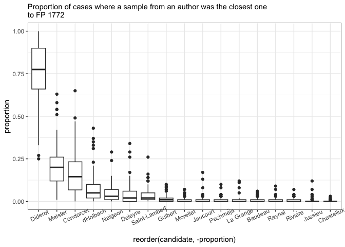
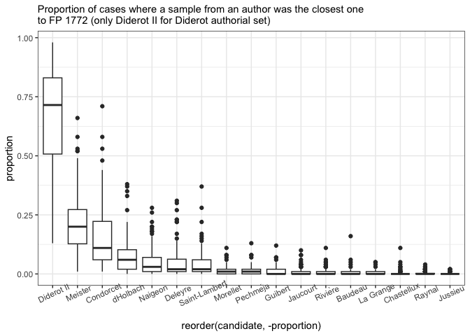

# 03_0_FP

## Fragments politiques - 1772

Ground truth tests of text fragment which supposed to be Diderot’s

### Load data & pckg

``` r
library(tidyverse)
library(tidytext)
library(stylo)
library(seetrees)
library(tinytex)

theme_set(theme_minimal())
library(MetBrewer)
```

``` r
corpus <- readRDS("../data/corpus_cln.Rds")

unique(corpus$author)
```

     [1] "Baudeau"                   "Chastellux"               
     [3] "Condorcet"                 "d"                        
     [5] "Deleyre"                   "Diderot II"               
     [7] "Diderot"                   "FP II (old version of FP)"
     [9] "Guibert"                   "H-FP"                     
    [11] "H-V-FP"                    "HDI(clean)"               
    [13] "Jaucourt"                  "Jussieu"                  
    [15] "Marmontel"                 "Meister"                  
    [17] "Morellet"                  "Naigeon"                  
    [19] "Pechméja"                  "Raynal"                   
    [21] "Rivière"                   "Saint-Lambert"            
    [23] "V-FP"                      "La Grange"                

``` r
corpus_tokenized <- corpus %>% 
  mutate(author = ifelse(author == "d", "dHolbach", author)) %>% 
  # remove old texts in question
  filter(!author %in% c("H-FP", "FP II (old version of FP)",
                        "H-V-FP", "V-FP", "HDI(clean)",
                        "Marmontel"))

glimpse(corpus_tokenized)
```

    Rows: 6,608,200
    Columns: 4
    $ path   <chr> "data//Baudeau_Avis .txt", "data//Baudeau_Avis .txt", "data//Ba…
    $ title  <chr> "Baudeau_Avis ", "Baudeau_Avis ", "Baudeau_Avis ", "Baudeau_Avi…
    $ author <chr> "Baudeau", "Baudeau", "Baudeau", "Baudeau", "Baudeau", "Baudeau…
    $ word   <chr> "a", "s", "a", "peuple", "sur", "son", "premier", "besoin", "pa…

``` r
# total number of tokens by each author, two samples from Diderot
corpus_tokenized %>% 
  count(author, sort = T) 
```

    # A tibble: 18 × 2
       author              n
       <chr>           <int>
     1 dHolbach      1223598
     2 Condorcet     1180934
     3 Raynal         668607
     4 Diderot II     394645
     5 Diderot        380769
     6 Guibert        351042
     7 Deleyre        320655
     8 Baudeau        297850
     9 Saint-Lambert  296834
    10 Jaucourt       257426
    11 Chastellux     246174
    12 Morellet       245226
    13 Jussieu        226997
    14 Naigeon        140696
    15 Rivière        140032
    16 La Grange      120000
    17 Pechméja        88244
    18 Meister         28471

``` r
rm(corpus)
```

``` r
fp1 <- tibble(
  path = "../corpus_fragments/test_fragments/FP1.txt",
  title = "1772_fragment_politique",
  author = "FP",
  text = read_file(path)
) %>% 
  unnest_tokens(input = text, output = word, token = "words")
```

### fn

``` r
sample_independent_opt <- function(tokenized_df,
  n_samples,
  sample_size,
  text_var = "word",
  folder = "corpus_sampled/", overwrite=T) {


  # create a folder
  dir.create(folder)
  
  # rewrite all files in the folder if the folder existed before
  if(overwrite) {
    do.call(file.remove, list(list.files(folder, full.names = TRUE)))
  }
  
  shuff <- tokenized_df %>%
    group_by(author) %>%
    sample_n(n_samples * sample_size) %>% # sample tokens
    # to each sampled token assign randomly a sample number
    mutate(sample_x = sample( # sample = reshuffle the numbers of samples repeated below
    rep( # repeat
      1:n_samples, # the numbers of samples (1, 2, 3...)
      each = sample_size # each is sample_size times repeated
      ))) %>%
    # create a column author_sampleX
    unite(sample_id, c(author, sample_x), remove = F) %>%
    # group and paste together by sample_id (some kind of special paste with !!sym() )
    group_by(sample_id) %>%
    summarise(text = paste(!!sym(text_var), collapse = " "))
    
    # write samples
    for(i in 1:nrow(shuff)) {
    write_file(file=paste0(folder, shuff$sample_id[i],".txt"), shuff$text[i])
  }
}
```

``` r
diy_stylo <- function(folder = "corpus_sampled/",
                      mfw = 200,
                      drop_words = T,
                      feature = "word",
                      n_gram = 1) {
  
  # read the sampled texts from the folder corpus_sampled/
  # the feature is either word or charaters
  # the tokenizer returns lists of tokens for each text from the folder
  tokenized.texts = load.corpus.and.parse(
    files = list.files(folder, full.names = T),
    features = feature,
    ngram.size = n_gram
  )
  # computing a list of most frequent words (trimmed to top 2000 items):
  features = make.frequency.list(tokenized.texts, head = 2000)
  # producing a table of relative frequencies:
  data = make.table.of.frequencies(tokenized.texts, features, relative = TRUE)#[,1:mfw]
  
  
  
  # --- cleaning ---
  # remove stop words
  s_words <- str_detect(colnames(data), str_dev_words) # output is a logical vector with the positions of the 
  if(drop_words) {
    data <- data[,!s_words]
  }
  # crop mfw
  data <- data[, 1:mfw]
  # clean document names
  
  rownames(data) <- str_remove_all(rownames(data), "corpus_sampled/") # Clean Rownammes
  rownames(data) <- str_remove_all(rownames(data), "^.*?//") # clean rownames from full paths
  
  
  # output
  return(data)
}
```

## Analysis

Number of words in FP 1772:

``` r
nrow(fp1)
```

    [1] 7891

``` r
fp_corpus <- rbind(fp1, corpus_tokenized) # corpus with two Diderot sets

# combined for imposters
fp_corpus_2 <- fp_corpus %>% 
  mutate(author = ifelse(author == "Diderot II", "Diderot", author))
```

### stylo tests

MFW 100

``` r
sample_independent_opt(tokenized_df = fp_corpus,
  n_samples = 2,
  sample_size = 3900)

test1 <- stylo(
  gui = F,
  corpus.dir = "corpus_sampled/",
  corpus.lang = "French",
  mfw.min = 100,
  mfw.max = 100,
  analyzed.features = "w",
  ngram.size = 1,
  distance.measure = "wurzburg"
  )
```


MFW 200

``` r
sample_independent_opt(tokenized_df = fp_corpus,
  n_samples = 2,
  sample_size = 3900)

test1 <- stylo(
  gui = F,
  corpus.dir = "corpus_sampled/",
  corpus.lang = "French",
  mfw.min = 200,
  mfw.max = 200,
  analyzed.features = "w",
  ngram.size = 1,
  distance.measure = "wurzburg"
  )
```


### BCT

MFW 50 - 250

``` r
sample_independent_opt(tokenized_df = fp_corpus,
  n_samples = 2,
  sample_size = 3900)

# bootstrap consensus tree
bct <- stylo(
  gui = F,
  corpus.dir = "corpus_sampled/",
  corpus.lang = "French",
  analyzed.features = "w",
  ngram.size = 1,
  mfw.min = 50,
  mfw.max = 250,
  mfw.incr = 1,
  distance.measure = "wurzburg",
  analysis.type = "BCT",
  consensus.strength = 0.5
)
```


MFW 50 - 450

``` r
sample_independent_opt(tokenized_df = fp_corpus,
  n_samples = 2,
  sample_size = 3900)

# bootstrap consensus tree
bct <- stylo(
  gui = F,
  corpus.dir = "corpus_sampled/",
  corpus.lang = "French",
  analyzed.features = "w",
  ngram.size = 1,
  mfw.min = 50,
  mfw.max = 450,
  mfw.incr = 1,
  distance.measure = "wurzburg",
  analysis.type = "BCT",
  consensus.strength = 0.5
)
```


### Imposters

#### All corpus

Use all texts from Diderot

``` r
imp_res <- vector(mode = "list")
r <- NULL
counter <- 0

for (i in 1:50) {
  
  # create samples for each trial
  sample_independent_opt(
    tokenized_df = fp_corpus_2, 
    n_samples = 2, 
    sample_size = 3900)
  
  # build doc-term matrix from the samples in the corpus_sampled folder
  data = diy_stylo(mfw = 200, 
                    feature = "word",
                    n_gram = 1)
  
  # test each of the true FV-L1 sets
  for (s in c(13, 14)) {
    
    # run imposters test
    r <- imposters(reference.set = data[-c(13, 14),], # remove test data from the ref
                   test = data[c(s),], # test one of the samples against the others
                   features = 0.5, # test 50% of the features in each trial
                   iterations = 100,
                   distance = "wurzburg"
                   )
    
    # count iterations
    counter <- counter + 1
    
    # store results
    
    imp_res[[counter]] <- tibble(candidate = names(r),
                                 proportion = r)
    
    print(counter)
  }
  
}

saveRDS(imp_res, "imp_res/impr_fp-1772.rds")
```

``` r
imp_res <- readRDS("imp_res/impr_fp-1772.rds")

imp_res %>%
  bind_rows() %>%  #stack all the optained prop tables into one
  mutate(candidate = str_remove(candidate, "^/")) %>% 
  ggplot(aes(x = reorder(candidate, - proportion),
  y = proportion)) +
  geom_boxplot() +
  theme_bw() + 
  labs(subtitle = "Proportion of cases where a sample from an author was the closest one\nto FP 1772") +
  theme(axis.text.x = element_text(angle = 25))
```



#### Diderot II

Use texts from Diderot II (Correspondences littéraires)

``` r
unique(fp_corpus$author)

fp_corpus_1 <- fp_corpus %>% 
  filter(author != "Diderot")

sample_independent_opt(tokenized_df = fp_corpus_1,
  n_samples = 2,
  sample_size = 3900)

dtm <- diy_stylo(
  folder = "corpus_sampled/",
  mfw = 200,
  drop_words = F)

grep("FP", rownames(dtm))

imp_res <- vector(mode = "list")
r <- NULL
counter <- 0

for (i in 1:50) {
  
  # create samples for each trial
  sample_independent_opt(
    tokenized_df = fp_corpus_1, 
    n_samples = 2, 
    sample_size = 3900)
  
  # build doc-term matrix from the samples in the corpus_sampled folder
  data = diy_stylo(mfw = 200, 
                    feature = "word",
                    n_gram = 1)
  
  # test each of the true FV-L1 sets
  for (s in c(13, 14)) {
    
    # run imposters test
    r <- imposters(reference.set = data[-c(13, 14),], # remove test data from the ref
                   test = data[c(s),], # test one of the samples against the others
                   features = 0.5, # test 50% of the features in each trial
                   iterations = 100,
                   distance = "wurzburg"
                   )
    
    # count iterations
    counter <- counter + 1
    
    # store results
    
    imp_res[[counter]] <- tibble(candidate = names(r),
                                 proportion = r)
    
    print(counter)
  }
  
}

saveRDS(imp_res, "imp_res/impr_fp-1772_diderotII.rds")
```

``` r
imp_res <- readRDS("imp_res/impr_fp-1772_diderotII.rds")

imp_res %>%
  bind_rows() %>%  #stack all the optained prop tables into one
  mutate(candidate = str_remove(candidate, "^/")) %>% 
  ggplot(aes(x = reorder(candidate, - proportion),
  y = proportion)) +
  geom_boxplot() +
  theme_bw() + 
  labs(subtitle = "Proportion of cases where a sample from an author was the closest one\nto FP 1772 (only Diderot II for Diderot authorial set)") +
  theme(axis.text.x = element_text(angle = 25))
```



#### Diderot I

``` r
unique(fp_corpus$author)

fp_corpus_1 <- fp_corpus %>% 
  filter(author != "Diderot II")

sample_independent_opt(tokenized_df = fp_corpus_1,
  n_samples = 2,
  sample_size = 3900)

dtm <- diy_stylo(
  folder = "corpus_sampled/",
  mfw = 200,
  drop_words = F)

grep("FP", rownames(dtm))

imp_res <- vector(mode = "list")
r <- NULL
counter <- 0

for (i in 1:50) {
  
  # create samples for each trial
  sample_independent_opt(
    tokenized_df = fp_corpus_1, 
    n_samples = 2, 
    sample_size = 3900)
  
  # build doc-term matrix from the samples in the corpus_sampled folder
  data = diy_stylo(mfw = 200, 
                    feature = "word",
                    n_gram = 1)
  
  # test each of the true FV-L1 sets
  for (s in c(13, 14)) {
    
    # run imposters test
    r <- imposters(reference.set = data[-c(13, 14),], # remove test data from the ref
                   test = data[c(s),], # test one of the samples against the others
                   features = 0.5, # test 50% of the features in each trial
                   iterations = 100,
                   distance = "wurzburg"
                   )
    
    # count iterations
    counter <- counter + 1
    
    # store results
    
    imp_res[[counter]] <- tibble(candidate = names(r),
                                 proportion = r)
    
    print(counter)
  }
  
}

saveRDS(imp_res, "imp_res/impr_fp-1772_diderotI.rds")
```

``` r
imp_res <- readRDS("imp_res/impr_fp-1772_diderotI.rds")

imp_res %>%
  bind_rows() %>%  #stack all the optained prop tables into one
  mutate(candidate = str_remove(candidate, "^/")) %>% 
  ggplot(aes(x = reorder(candidate, - proportion),
  y = proportion)) +
  geom_boxplot() +
  theme_bw() + 
  labs(subtitle = "Proportion of cases where a sample from an author was the closest one\nto FP 1772 (only Diderot I for Diderot authorial set)") +
  theme(axis.text.x = element_text(angle = 25))
```


