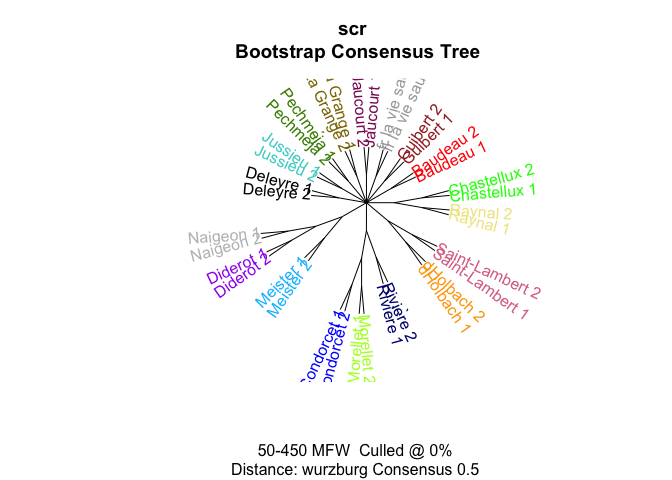

# 03_2_analysis_additional

## Additional tests for FV fragments

``` r
library(tidyverse)
library(tidytext)
library(stylo)
library(seetrees)
library(tinytex)

theme_set(theme_minimal())
library(MetBrewer)
```

Load data

``` r
corpus <- readRDS("../data/corpus_cln.Rds")

unique(corpus$author)
```

     [1] "Baudeau"                   "Chastellux"               
     [3] "Condorcet"                 "d"                        
     [5] "Deleyre"                   "Diderot II"               
     [7] "Diderot"                   "FP II (old version of FP)"
     [9] "Guibert"                   "H-FP"                     
    [11] "H-V-FP"                    "HDI(clean)"               
    [13] "Jaucourt"                  "Jussieu"                  
    [15] "Marmontel"                 "Meister"                  
    [17] "Morellet"                  "Naigeon"                  
    [19] "Pechméja"                  "Raynal"                   
    [21] "Rivière"                   "Saint-Lambert"            
    [23] "V-FP"                      "La Grange"                

``` r
corpus_tokenized <- corpus %>% 
  mutate(author = ifelse(author == "d", "dHolbach", author)) %>% 
  # remove old texts in question
  filter(!author %in% c("H-FP", "FP II (old version of FP)",
                        "H-V-FP", "V-FP", "HDI(clean)",
                        "Marmontel"))

glimpse(corpus_tokenized)
```

    Rows: 6,608,200
    Columns: 4
    $ path   <chr> "data//Baudeau_Avis .txt", "data//Baudeau_Avis .txt", "data//Ba…
    $ title  <chr> "Baudeau_Avis ", "Baudeau_Avis ", "Baudeau_Avis ", "Baudeau_Avi…
    $ author <chr> "Baudeau", "Baudeau", "Baudeau", "Baudeau", "Baudeau", "Baudeau…
    $ word   <chr> "a", "s", "a", "peuple", "sur", "son", "premier", "besoin", "pa…

``` r
# total number of tokens by each author, two samples from Diderot
corpus_tokenized %>% 
  count(author, sort = T) 
```

    # A tibble: 18 × 2
       author              n
       <chr>           <int>
     1 dHolbach      1223598
     2 Condorcet     1180934
     3 Raynal         668607
     4 Diderot II     394645
     5 Diderot        380769
     6 Guibert        351042
     7 Deleyre        320655
     8 Baudeau        297850
     9 Saint-Lambert  296834
    10 Jaucourt       257426
    11 Chastellux     246174
    12 Morellet       245226
    13 Jussieu        226997
    14 Naigeon        140696
    15 Rivière        140032
    16 La Grange      120000
    17 Pechméja        88244
    18 Meister         28471

``` r
rm(corpus)
```

Test fragments

``` r
rchina <- tibble(
  path = "../corpus_fragments/test_fragments/fr_on_russia-china.txt",
  title = "fr_russia_china",
  author = "fr_russia_china",
  text = read_file(path)
) %>% 
  unnest_tokens(input = text, output = word, token = "words")

sauvage <- tibble(
  path = "../corpus_fragments/test_fragments/fr_sauvage.txt",
  title = "fr_la vie sauvage",
  author = "fr_la vie sauvage",
  text = read_file(path)
) %>% 
  unnest_tokens(input = text, output = word, token = "words")

ink_only <- tibble(
  path = "../corpus_fragments/test_fragments/ink_melanges_not-in-pencil.txt",
  title = "ink_mélanges_only",
  author = "ink_mélanges_only",
  text = read_file(path)
) %>% 
  unnest_tokens(input = text, output = word, token = "words")
```

### fn

``` r
sample_independent_opt <- function(tokenized_df,
  n_samples,
  sample_size,
  text_var = "word",
  folder = "corpus_sampled/", overwrite=T) {


  # create a folder
  dir.create(folder)
  
  # rewrite all files in the folder if the folder existed before
  if(overwrite) {
    do.call(file.remove, list(list.files(folder, full.names = TRUE)))
  }
  
  shuff <- tokenized_df %>%
    group_by(author) %>%
    sample_n(n_samples * sample_size) %>% # sample tokens
    # to each sampled token assign randomly a sample number
    mutate(sample_x = sample( # sample = reshuffle the numbers of samples repeated below
    rep( # repeat
      1:n_samples, # the numbers of samples (1, 2, 3...)
      each = sample_size # each is sample_size times repeated
      ))) %>%
    # create a column author_sampleX
    unite(sample_id, c(author, sample_x), remove = F) %>%
    # group and paste together by sample_id (some kind of special paste with !!sym() )
    group_by(sample_id) %>%
    summarise(text = paste(!!sym(text_var), collapse = " "))
    
    # write samples
    for(i in 1:nrow(shuff)) {
    write_file(file=paste0(folder, shuff$sample_id[i],".txt"), shuff$text[i])
  }
}
```

``` r
diy_stylo <- function(folder = "corpus_sampled/",
                      mfw = 200,
                      drop_words = T,
                      feature = "word",
                      n_gram = 1) {
  
  # read the sampled texts from the folder corpus_sampled/
  # the feature is either word or charaters
  # the tokenizer returns lists of tokens for each text from the folder
  tokenized.texts = load.corpus.and.parse(
    files = list.files(folder, full.names = T),
    features = feature,
    ngram.size = n_gram
  )
  # computing a list of most frequent words (trimmed to top 2000 items):
  features = make.frequency.list(tokenized.texts, head = 2000)
  # producing a table of relative frequencies:
  data = make.table.of.frequencies(tokenized.texts, features, relative = TRUE)#[,1:mfw]
  
  
  
  # --- cleaning ---
  # remove stop words
  s_words <- str_detect(colnames(data), str_dev_words) # output is a logical vector with the positions of the 
  if(drop_words) {
    data <- data[,!s_words]
  }
  # crop mfw
  data <- data[, 1:mfw]
  # clean document names
  
  rownames(data) <- str_remove_all(rownames(data), "corpus_sampled/") # Clean Rownammes
  rownames(data) <- str_remove_all(rownames(data), "^.*?//") # clean rownames from full paths
  
  
  # output
  return(data)
}
```

## Fragments on China & Russia

``` r
china_r_corpus <- rbind(rchina, corpus_tokenized)

china_r_corpus <- china_r_corpus %>% 
  mutate(author = ifelse(author == "Diderot II", "Diderot", author))
```

``` r
sample_independent_opt(tokenized_df = china_r_corpus,
  n_samples = 2,
  sample_size = 2600)
```

    Warning in dir.create(folder): 'corpus_sampled' already exists

### stylo test

``` r
test1 <- stylo(
  gui = F,
  corpus.dir = "corpus_sampled/",
  corpus.lang = "French",
  mfw.min = 200,
  mfw.max = 200,
  analyzed.features = "w",
  ngram.size = 1,
  distance.measure = "wurzburg"
  )
```


### mfw200

``` r
test1$features.actually.used
```


    ------------------------------------------------
    features (e.g. frequent words) actually analyzed 
    ------------------------------------------------

      [1]  de            la            les           et            le            
      [6]  l             à            des           que           il            
     [11]  d             qui           qu            est           en            
     [16]  un            dans          ne            une           pour          
     [21]  on            par           plus          n             a             
     [26]  du            ce            se            pas           s             
     [31]  au            ou            y             sur           nous          
     [36]  je            ils           leur          ces           elle          
     [41]  lui           son           vous          mais          ses           
     [46]  si            cette         même         être         aux           
     [51]  avec          tout          sa            comme         peut          
     [56]  sans          sont          ont           tous          fait          
     [61]  leurs         bien          faire         dont          point         
     [66]  où           font          autres        t             ni            
     [71]  homme         ceux          me            hommes        avoir         
     [76]  nos           toutes        encore        deux          moins         
     [81]  autre         faut          elles         été         avoit         
     [86]  celui         étoit        cet           donc          dit           
     [91]  nature        peu           grand         quelques      toujours      
     [96]  celle         jamais        toute         corps         fut           
    [101]  quelque       aussi         contre        quand         eux           
    [106]  parce         après        liberté      notre         trop          
    [111]  doit          peuple        vie           mon           dire          
    [116]  ordre         non           raison        ai            ainsi         
    [121]  nombre        rien          très         trois         soit          
    [126]  terre         car           état         commerce      entre         
    [131]  beaucoup      intérêt     enfin         esprit        alors         
    [136]  sera          souvent       force         lieu          avait         
    [141]  mêmes        premier       société     jusqu         nation        
    [146]  cependant     droit         était        pays          vos           
    [151]  plusieurs     avons         bonheur       cela          moyens        
    [156]  partie        peuvent       religion      rendre        choses        
    [161]  comment       dieu          donner        grands        seul          
    [166]  ait           eu            là           roi           sous          
    [171]  tant          votre         grande        idées        loix          
    [176]  mes           yeux          effet         fit           fort          
    [181]  ma            depuis        gens          lorsqu        voir          
    [186]  autant        celles        étoient      moment        moyen         
    [191]  page          principes     seroit        voit          argent        
    [196]  gouvernement  ici           monde         nom           temps         

    (total number of elements:  200)

### BCT

``` r
# bootstrap consensus tree
bct <- stylo(
  gui = F,
  corpus.dir = "corpus_sampled/",
  corpus.lang = "French",
  analyzed.features = "w",
  ngram.size = 1,
  mfw.min = 50,
  mfw.max = 450,
  mfw.incr = 1,
  distance.measure = "wurzburg",
  analysis.type = "BCT",
  consensus.strength = 0.5
)
```


### Imposters

``` r
# var needed for diy fn
str_dev_words <- c("et")
```

``` r
imp_res <- vector(mode = "list")
r <- NULL
counter <- 0

for (i in 1:50) {
  
  # create samples for each trial
  sample_independent_opt(
    tokenized_df = china_r_corpus, 
    n_samples = 2, 
    sample_size = 2500)
  
  # build doc-term matrix from the samples in the corpus_sampled folder
  data = diy_stylo(mfw = 200, 
                    feature = "word",
                    n_gram = 1)
  
  # test each of the true FV-L1 sets
  for (s in c(13, 14)) {
    
    # run imposters test
    r <- imposters(reference.set = data[-c(13, 14),], # remove test data from the ref
                   test = data[c(s),], # test one of the samples against the others
                   features = 0.5, # test 50% of the features in each trial
                   iterations = 100,
                   distance = "wurzburg"
                   )
    
    # count iterations
    counter <- counter + 1
    
    # store results
    
    imp_res[[counter]] <- tibble(candidate = names(r),
                                 proportion = r)
    
    print(counter)
  }
  
}

saveRDS(imp_res, "imp_res/impr_fr_china-russia.rds")
```

``` r
imp_res <- readRDS("imp_res/impr_fr_china-russia.rds")

imp_res %>%
  bind_rows() %>%  #stack all the optained prop tables into one
  mutate(candidate = str_remove(candidate, "^/")) %>% 
  ggplot(aes(x = reorder(candidate, - proportion),
  y = proportion)) +
  geom_boxplot() +
  theme_bw() + 
  labs(subtitle = "Proportion of cases where a sample from an author was the closest one\nto the fragments on Russia (68, 310) and China (12)") +
  theme(axis.text.x = element_text(angle = 25))
```


## Framgent ‘Les avantages de la vie sauvage’

``` r
sauvage_corpus <- rbind(sauvage, corpus_tokenized) %>% 
  mutate(author = ifelse(author == "Diderot II", "Diderot", author))
```

``` r
sample_independent_opt(tokenized_df = sauvage_corpus,
  n_samples = 2,
  sample_size = 4000)
```

    Warning in dir.create(folder): 'corpus_sampled' already exists

### stylo test

``` r
test1 <- stylo(
  gui = F,
  corpus.dir = "corpus_sampled/",
  corpus.lang = "French",
  mfw.min = 200,
  mfw.max = 200,
  analyzed.features = "w",
  ngram.size = 1,
  distance.measure = "wurzburg"
  )
```


### mfw200

``` r
test1$features.actually.used
```


    ------------------------------------------------
    features (e.g. frequent words) actually analyzed 
    ------------------------------------------------

      [1]  de         la         les        et         l          le         
      [7]  à         que        des        il         d          qui        
     [13]  qu         en         un         est        dans       ne         
     [19]  une        pour       on         par        ce         n          
     [25]  plus       du         a          se         pas        s          
     [31]  au         ou         sur        nous       je         ils        
     [37]  y          mais       leur       elle       lui        ses        
     [43]  si         son        cette      avec       ces        même      
     [49]  être      aux        vous       sans       sa         tout       
     [55]  comme      peut       dont       tous       fait       ont        
     [61]  sont       leurs      point      bien       faire      font       
     [67]  encore     homme      autres     moins      deux       me         
     [73]  hommes     autre      ni         toutes     où        t          
     [79]  elles      avoir      ceux       toujours   étoit     cet        
     [85]  faut       nos        peu        celui      nature     donc       
     [91]  été      rien       jamais     ai         après     doit       
     [97]  parce      entre      avoit      dit        quelque    ainsi      
    [103]  toute      quelques   mon        soit       là        commerce   
    [109]  corps      grand      aussi      fut        liberté   celle      
    [115]  dire       quand      contre     notre      raison     vie        
    [121]  mêmes     ordre      sera       très      nombre     non        
    [127]  trop       état      eux        mes        tant       force      
    [133]  grande     alors      mal        beaucoup   peuple     dieu       
    [139]  prix       enfin      partie     temps      terre      souvent    
    [145]  ma         lieu       loix       chaque     roi        société  
    [151]  sous       car        cependant  droit      effet      esprit     
    [157]  jour       trois      fois       nation     peuvent    seul       
    [163]  cela       premier    moi        mort       pays       général  
    [169]  monde      moyens     votre      chez       avait      intérêt  
    [175]  voir       aucun      avons      était     plusieurs  rendre     
    [181]  ait        assez      autant     choses     doute      seroit     
    [187]  âme       bonheur    doivent    ici        jusqu      lorsqu     
    [193]  principes  ci         objet      vos        fort       grands     
    [199]  loi        or         

    (total number of elements:  200)

### BCT

``` r
# bootstrap consensus tree
bct <- stylo(
  gui = F,
  corpus.dir = "corpus_sampled/",
  corpus.lang = "French",
  analyzed.features = "w",
  ngram.size = 1,
  mfw.min = 50,
  mfw.max = 450,
  mfw.incr = 1,
  distance.measure = "wurzburg",
  analysis.type = "BCT",
  consensus.strength = 0.5
)
```



### Imposters

``` r
imp_res <- vector(mode = "list")

counter <- 0

for (i in 1:50) {
  
  # create samples for each trial
  sample_independent_opt(
    tokenized_df = sauvage_corpus, 
    n_samples = 2, 
    sample_size = 4000)
  
  # build doc-term matrix from the samples in the corpus_sampled folder
  data = diy_stylo(mfw = 200, 
                    feature = "word",
                    n_gram = 1)
  
  # test each of the true FV-L1 sets
  for (s in c(13, 14)) {
    
    # run imposters test
    r <- imposters(reference.set = data[-c(13, 14),], # remove test data from the ref
                   test = data[c(s),], # test one of the samples against the others
                   features = 0.5, # test 50% of the features in each trial
                   iterations = 100,
                   distance = "wurzburg"
                   )
    
    # count iterations
    counter <- counter + 1
    
    # store results
    
    imp_res[[counter]] <- tibble(candidate = names(r),
                                 proportion = r)
    
    print(counter)
  }
  
}

saveRDS(imp_res, "imp_res/impr_fr_la-vie-sauvage.rds")
```

``` r
imp_res <- readRDS("imp_res/impr_fr_la-vie-sauvage.rds")

imp_res %>%
  bind_rows() %>%  #stack all the optained prop tables into one
  mutate(candidate = str_remove(candidate, "^/")) %>% 
  ggplot(aes(x = reorder(candidate, - proportion),
  y = proportion)) +
  geom_boxplot() +
  theme_bw() + 
  labs(subtitle = "Proportion of cases where a sample from an author was the closest one\nto the fragment 'Les avantages de la vie sauvage'") +
  theme(axis.text.x = element_text(angle = 25, size = 12))
```


## Ink selection: fragments, appeared only in Mélanges

N words = 37 580

``` r
ink_selection_corpus <- rbind(ink_only, corpus_tokenized)
```

``` r
sample_independent_opt(tokenized_df = ink_selection_corpus,
  n_samples = 2,
  sample_size = 5000)
```

    Warning in dir.create(folder): 'corpus_sampled' already exists

### stylo test

``` r
test1 <- stylo(
  gui = F,
  corpus.dir = "corpus_sampled/",
  corpus.lang = "French",
  mfw.min = 200,
  mfw.max = 200,
  analyzed.features = "w",
  ngram.size = 1,
  distance.measure = "wurzburg"
  )
```


``` r
test1$features.actually.used
```


    ------------------------------------------------
    features (e.g. frequent words) actually analyzed 
    ------------------------------------------------

      [1]  de         la         les        et         l          le         
      [7]  à         que        des        il         d          qui        
     [13]  qu         en         est        un         dans       ne         
     [19]  une        pour       on         plus       du         ce         
     [25]  a          par        n          pas        se         s          
     [31]  ou         nous       au         sur        je         ils        
     [37]  y          mais       vous       elle       leur       ces        
     [43]  si         ses        son        cette      même      lui        
     [49]  sa         avec       être      aux        tout       comme      
     [55]  sans       sont       ont        leurs      peut       bien       
     [61]  tous       point      fait       dont       faire      autres     
     [67]  où        encore     me         font       avoir      ni         
     [73]  moins      deux       ceux       autre      t          toutes     
     [79]  nos        elles      homme      hommes     cet        faut       
     [85]  celui      étoit     nature     dit        avoit      toute      
     [91]  été      donc       peu        doit       toujours   ainsi      
     [97]  grand      après     aussi      fut        très      ai         
    [103]  dire       entre      notre      jamais     raison     quand      
    [109]  liberté   soit       non        trop       celle      corps      
    [115]  quelque    mon        parce      rien       vie        contre     
    [121]  eux        quelques   votre      dieu       ordre      était     
    [127]  là        souvent    mêmes     commerce   car        tant       
    [133]  partie     sous       temps      cela       sera       terre      
    [139]  trois      alors      grande     force      nombre     beaucoup   
    [145]  jusqu      état      mes        esprit     vos        droit      
    [151]  enfin      roi        chaque     tu         autant     peuple     
    [157]  ait        général  peuvent    plusieurs  premier    effet      
    [163]  fort       mieux      guerre     lieu       jour       avait      
    [169]  cependant  fois       prix       amour      ma         nom        
    [175]  seul       voir       ci         donner     moi        pays       
    [181]  avons      vérité   vertu      monde      seroit     société  
    [187]  bonheur    loi        mal        intérêt  lorsque    étoient   
    [193]  aucun      lorsqu     rendre     assez      grands     pouvoir    
    [199]  chez       chose      

    (total number of elements:  200)

### BCT

``` r
# bootstrap consensus tree
bct <- stylo(
  gui = F,
  corpus.dir = "corpus_sampled/",
  corpus.lang = "French",
  analyzed.features = "w",
  ngram.size = 1,
  mfw.min = 50,
  mfw.max = 250,
  mfw.incr = 1,
  distance.measure = "wurzburg",
  analysis.type = "BCT",
  consensus.strength = 0.5
)
```


### Imposters

``` r
imp_res <- vector(mode = "list")

counter <- 0

for (i in 1:50) {
  
  # create samples for each trial
  sample_independent_opt(
    tokenized_df = ink_selection_corpus, 
    n_samples = 2, 
    sample_size = 5000)
  
  # build doc-term matrix from the samples in the corpus_sampled folder
  data = diy_stylo(mfw = 200, 
                    feature = "word",
                    n_gram = 1)
  
  # test each of the true FV-L1 sets
  for (s in c(15, 16)) {
    
    # run imposters test
    r <- imposters(reference.set = data[-c(15, 16),], # remove test data from the ref
                   test = data[c(s),], # test one of the samples against the others
                   features = 0.5, # test 50% of the features in each trial
                   iterations = 100,
                   distance = "wurzburg"
                   )
    
    # count iterations
    counter <- counter + 1
    
    # store results
    
    imp_res[[counter]] <- tibble(candidate = names(r),
                                 proportion = r)
    
    print(counter)
  }
  
}

saveRDS(imp_res, "imp_res/impr_ink_only_selection.rds")
```

``` r
imp_res <- readRDS("imp_res/impr_ink_only_selection.rds")

imp_res %>%
  bind_rows() %>%  #stack all the optained prop tables into one
  ggplot(aes(x = reorder(candidate, - proportion),
  y = proportion)) +
  geom_boxplot() +
  theme_bw() + 
  labs(subtitle = "Proportion of cases where a sample from an author was the closest one\nto the selection of fragments from Mélanges (fragments not included in PD)") +
  theme(axis.text.x = element_text(angle = 25))
```


