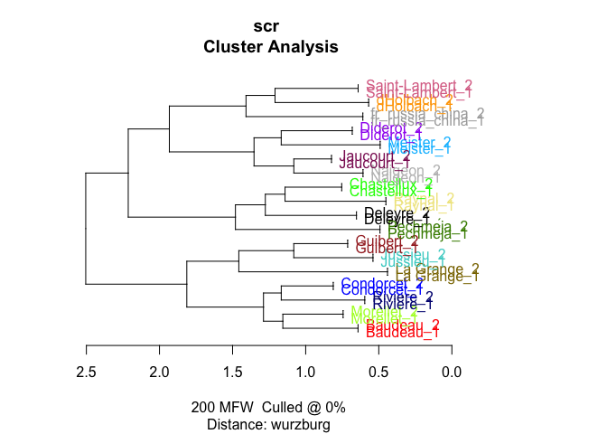
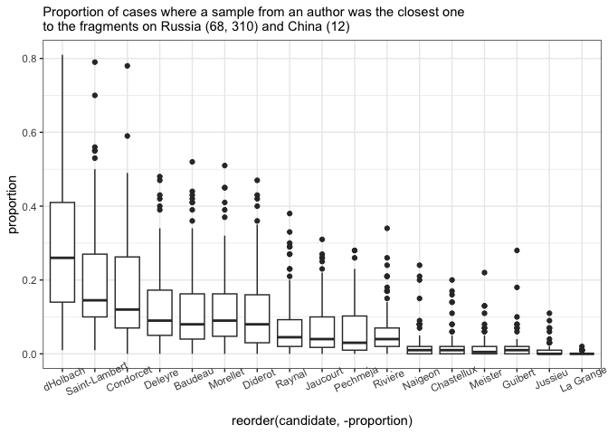
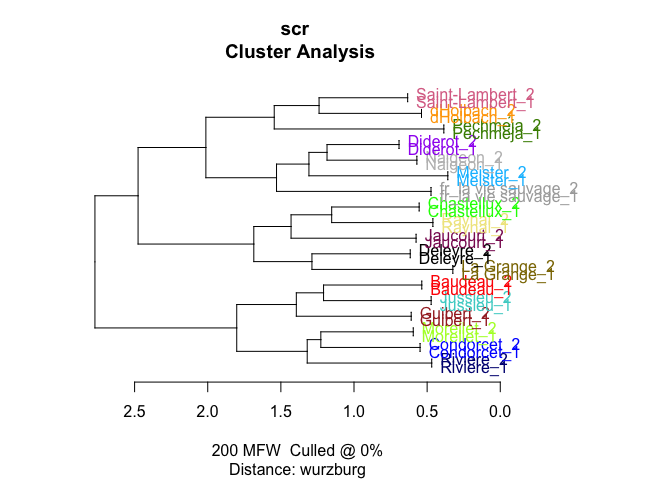
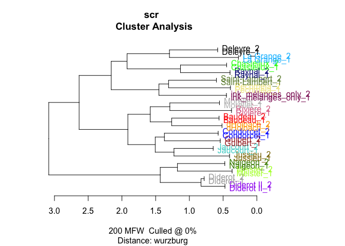

# 03_2_analysis_additional

## Additional tests for FV fragments

``` r
library(tidyverse)
library(tidytext)
library(stylo)
library(seetrees)
library(tinytex)

theme_set(theme_minimal())
library(MetBrewer)
```

Load data

``` r
corpus <- readRDS("../data/corpus_cln.Rds")

unique(corpus$author)
```

     [1] "Baudeau"                   "Chastellux"               
     [3] "Condorcet"                 "d"                        
     [5] "Deleyre"                   "Diderot II"               
     [7] "Diderot"                   "FP II (old version of FP)"
     [9] "Guibert"                   "H-FP"                     
    [11] "H-V-FP"                    "HDI(clean)"               
    [13] "Jaucourt"                  "Jussieu"                  
    [15] "Marmontel"                 "Meister"                  
    [17] "Morellet"                  "Naigeon"                  
    [19] "Pechméja"                  "Raynal"                   
    [21] "Rivière"                   "Saint-Lambert"            
    [23] "V-FP"                      "La Grange"                

``` r
corpus_tokenized <- corpus %>% 
  mutate(author = ifelse(author == "d", "dHolbach", author)) %>% 
  # remove old texts in question
  filter(!author %in% c("H-FP", "FP II (old version of FP)",
                        "H-V-FP", "V-FP", "HDI(clean)",
                        "Marmontel"))

glimpse(corpus_tokenized)
```

    Rows: 6,608,200
    Columns: 4
    $ path   <chr> "data//Baudeau_Avis .txt", "data//Baudeau_Avis .txt", "data//Ba…
    $ title  <chr> "Baudeau_Avis ", "Baudeau_Avis ", "Baudeau_Avis ", "Baudeau_Avi…
    $ author <chr> "Baudeau", "Baudeau", "Baudeau", "Baudeau", "Baudeau", "Baudeau…
    $ word   <chr> "a", "s", "a", "peuple", "sur", "son", "premier", "besoin", "pa…

``` r
# total number of tokens by each author, two samples from Diderot
corpus_tokenized %>% 
  count(author, sort = T) 
```

    # A tibble: 18 × 2
       author              n
       <chr>           <int>
     1 dHolbach      1223598
     2 Condorcet     1180934
     3 Raynal         668607
     4 Diderot II     394645
     5 Diderot        380769
     6 Guibert        351042
     7 Deleyre        320655
     8 Baudeau        297850
     9 Saint-Lambert  296834
    10 Jaucourt       257426
    11 Chastellux     246174
    12 Morellet       245226
    13 Jussieu        226997
    14 Naigeon        140696
    15 Rivière        140032
    16 La Grange      120000
    17 Pechméja        88244
    18 Meister         28471

``` r
rm(corpus)
```

Test fragments

``` r
rchina <- tibble(
  path = "../corpus_fragments/test_fragments/fr_on_russia-china.txt",
  title = "fr_russia_china",
  author = "fr_russia_china",
  text = read_file(path)
) %>% 
  unnest_tokens(input = text, output = word, token = "words")

sauvage <- tibble(
  path = "../corpus_fragments/test_fragments/fr_sauvage.txt",
  title = "fr_la vie sauvage",
  author = "fr_la vie sauvage",
  text = read_file(path)
) %>% 
  unnest_tokens(input = text, output = word, token = "words")

ink_only <- tibble(
  path = "../corpus_fragments/test_fragments/ink_melanges_not-in-pencil.txt",
  title = "ink_mélanges_only",
  author = "ink_mélanges_only",
  text = read_file(path)
) %>% 
  unnest_tokens(input = text, output = word, token = "words")
```

### fn

``` r
sample_independent_opt <- function(tokenized_df,
  n_samples,
  sample_size,
  text_var = "word",
  folder = "corpus_sampled/", overwrite=T) {


  # create a folder
  dir.create(folder)
  
  # rewrite all files in the folder if the folder existed before
  if(overwrite) {
    do.call(file.remove, list(list.files(folder, full.names = TRUE)))
  }
  
  shuff <- tokenized_df %>%
    group_by(author) %>%
    sample_n(n_samples * sample_size) %>% # sample tokens
    # to each sampled token assign randomly a sample number
    mutate(sample_x = sample( # sample = reshuffle the numbers of samples repeated below
    rep( # repeat
      1:n_samples, # the numbers of samples (1, 2, 3...)
      each = sample_size # each is sample_size times repeated
      ))) %>%
    # create a column author_sampleX
    unite(sample_id, c(author, sample_x), remove = F) %>%
    # group and paste together by sample_id (some kind of special paste with !!sym() )
    group_by(sample_id) %>%
    summarise(text = paste(!!sym(text_var), collapse = " "))
    
    # write samples
    for(i in 1:nrow(shuff)) {
    write_file(file=paste0(folder, shuff$sample_id[i],".txt"), shuff$text[i])
  }
}
```

``` r
diy_stylo <- function(folder = "corpus_sampled/",
                      mfw = 200,
                      drop_words = T,
                      feature = "word",
                      n_gram = 1) {
  
  # read the sampled texts from the folder corpus_sampled/
  # the feature is either word or charaters
  # the tokenizer returns lists of tokens for each text from the folder
  tokenized.texts = load.corpus.and.parse(
    files = list.files(folder, full.names = T),
    features = feature,
    ngram.size = n_gram
  )
  # computing a list of most frequent words (trimmed to top 2000 items):
  features = make.frequency.list(tokenized.texts, head = 2000)
  # producing a table of relative frequencies:
  data = make.table.of.frequencies(tokenized.texts, features, relative = TRUE)#[,1:mfw]
  
  
  
  # --- cleaning ---
  # remove stop words
  s_words <- str_detect(colnames(data), str_dev_words) # output is a logical vector with the positions of the 
  if(drop_words) {
    data <- data[,!s_words]
  }
  # crop mfw
  data <- data[, 1:mfw]
  # clean document names
  
  rownames(data) <- str_remove_all(rownames(data), "corpus_sampled/") # Clean Rownammes
  rownames(data) <- str_remove_all(rownames(data), "^.*?//") # clean rownames from full paths
  
  
  # output
  return(data)
}
```

## Fragments on China & Russia

``` r
china_r_corpus <- rbind(rchina, corpus_tokenized)
```

``` r
sample_independent_opt(tokenized_df = china_r_corpus,
  n_samples = 2,
  sample_size = 2600)
```

    Warning in dir.create(folder): 'corpus_sampled' already exists

### stylo test

``` r
test1 <- stylo(
  gui = F,
  corpus.dir = "corpus_sampled/",
  corpus.lang = "French",
  mfw.min = 200,
  mfw.max = 200,
  analyzed.features = "w",
  ngram.size = 1,
  distance.measure = "wurzburg"
  )
```



### mfw200

``` r
test1$features.actually.used
```


    ------------------------------------------------
    features (e.g. frequent words) actually analyzed 
    ------------------------------------------------

      [1]  de            la            les           et            le            
      [6]  l             à            des           que           il            
     [11]  d             qu            qui           en            est           
     [16]  un            dans          ne            une           on            
     [21]  plus          ce            par           du            pour          
     [26]  a             n             pas           se            s             
     [31]  ou            nous          y             au            sur           
     [36]  je            ils           ces           vous          elle          
     [41]  lui           son           mais          leur          cette         
     [46]  être         même         ses           si            avec          
     [51]  sa            tout          aux           comme         sans          
     [56]  bien          sont          ont           peut          leurs         
     [61]  tous          fait          dont          où           faire         
     [66]  point         homme         deux          font          autres        
     [71]  toutes        encore        t             autre         me            
     [76]  hommes        elles         nos           avoir         ni            
     [81]  moins         celui         été         peu           faut          
     [86]  cet           ceux          soit          étoit        nature        
     [91]  raison        grand         toute         aussi         doit          
     [96]  toujours      corps         ainsi         dit           notre         
    [101]  quand         liberté      vie           entre         rien          
    [106]  dire          quelques      quelque       ai            donc          
    [111]  non           mêmes        mon           après        avoit         
    [116]  fut           jamais        là           contre        état         
    [121]  parce         très         trop          commerce      dieu          
    [126]  eux           tant          trois         celle         peuple        
    [131]  sera          beaucoup      alors         ordre         esprit        
    [136]  cependant     car           premier       droit         grande        
    [141]  monde         cela          fort          nombre        votre         
    [146]  nation        société     voir          jusqu         souvent       
    [151]  terre         était        général     chaque        lieu          
    [156]  mieux         roi           depuis        donner        plusieurs     
    [161]  avait         effet         gouvernement  prix          ait           
    [166]  fois          guerre        autant        force         jour          
    [171]  ma            vérité      intérêt     partie        sous          
    [176]  aucun         bonheur       enfin         seule         voit          
    [181]  doute         ici           loi           long          rendre        
    [186]  loix          yeux          mal           vers          amour         
    [191]  grands        peuvent       seroit        trouve        bon           
    [196]  comment       nom           pays          temps         assez         

    (total number of elements:  200)

### BCT

``` r
# bootstrap consensus tree
bct <- stylo(
  gui = F,
  corpus.dir = "corpus_sampled/",
  corpus.lang = "French",
  analyzed.features = "w",
  ngram.size = 1,
  mfw.min = 50,
  mfw.max = 250,
  mfw.incr = 1,
  distance.measure = "wurzburg",
  analysis.type = "BCT",
  consensus.strength = 0.5
)
```


### Imposters

``` r
# var needed for diy fn
str_dev_words <- c("et")
```

``` r
imp_res <- vector(mode = "list")

counter <- 0

for (i in 1:50) {
  
  # create samples for each trial
  sample_independent_opt(
    tokenized_df = china_r_corpus, 
    n_samples = 2, 
    sample_size = 2500)
  
  # build doc-term matrix from the samples in the corpus_sampled folder
  data = diy_stylo(mfw = 200, 
                    feature = "word",
                    n_gram = 1)
  
  # test each of the true FV-L1 sets
  for (s in c(15, 16)) {
    
    # run imposters test
    r <- imposters(reference.set = data[-c(15, 16),], # remove test data from the ref
                   test = data[c(s),], # test one of the samples against the others
                   features = 0.5, # test 50% of the features in each trial
                   iterations = 100,
                   distance = "wurzburg"
                   )
    
    # count iterations
    counter <- counter + 1
    
    # store results
    
    imp_res[[counter]] <- tibble(candidate = names(r),
                                 proportion = r)
    
    print(counter)
  }
  
}

saveRDS(imp_res, "imp_res/impr_fr_china-russia.rds")
```

``` r
imp_res <- readRDS("imp_res/impr_fr_china-russia.rds")

imp_res %>%
  bind_rows() %>%  #stack all the optained prop tables into one
  ggplot(aes(x = reorder(candidate, - proportion),
  y = proportion)) +
  geom_boxplot() +
  theme_bw() + 
  labs(subtitle = "Proportion of cases where a sample from an author was the closest one\nto the fragments on Russia (68, 310) and China (12)") +
  theme(axis.text.x = element_text(angle = 25))
```



## Framgent ‘Les avantages de la vie sauvage’

``` r
sauvage_corpus <- rbind(sauvage, corpus_tokenized) %>% 
  mutate(author = ifelse(author == "Diderot II", "Diderot", author))
```

``` r
sample_independent_opt(tokenized_df = sauvage_corpus,
  n_samples = 2,
  sample_size = 4000)
```

    Warning in dir.create(folder): 'corpus_sampled' already exists

### stylo test

``` r
test1 <- stylo(
  gui = F,
  corpus.dir = "corpus_sampled/",
  corpus.lang = "French",
  mfw.min = 200,
  mfw.max = 200,
  analyzed.features = "w",
  ngram.size = 1,
  distance.measure = "wurzburg"
  )
```



### mfw200

``` r
test1$features.actually.used
```


    ------------------------------------------------
    features (e.g. frequent words) actually analyzed 
    ------------------------------------------------

      [1]  de            la            les           et            l             
      [6]  le            à            que           des           il            
     [11]  d             qui           qu            en            est           
     [16]  un            dans          ne            une           pour          
     [21]  on            plus          du            par           n             
     [26]  ce            a             se            pas           s             
     [31]  ou            sur           au            y             je            
     [36]  nous          leur          ils           mais          elle          
     [41]  son           cette         vous          ces           si            
     [46]  lui           ses           même         être         avec          
     [51]  aux           sa            sans          ont           tout          
     [56]  bien          peut          point         tous          comme         
     [61]  sont          fait          dont          faire         leurs         
     [66]  font          autres        homme         me            moins         
     [71]  deux          où           toutes        t             autre         
     [76]  hommes        encore        ni            nos           avoir         
     [81]  été         toujours      ceux          elles         doit          
     [86]  cet           faut          celui         donc          peu           
     [91]  grand         jamais        dit           toute         ai            
     [96]  étoit        entre         après        avoit         soit          
    [101]  ainsi         nature        raison        très         notre         
    [106]  corps         dire          non           rien          aussi         
    [111]  ordre         quelque       parce         vie           mon           
    [116]  trop          état         liberté      quand         contre        
    [121]  quelques      eux           là           celle         tant          
    [126]  temps         peuple        fois          mes           force         
    [131]  sera          commerce      fut           terre         beaucoup      
    [136]  droit         mêmes        dieu          esprit        chaque        
    [141]  grande        partie        souvent       alors         car           
    [146]  plusieurs     voir          lieu          était        ma            
    [151]  cela          peuvent       prix          votre         nation        
    [156]  loix          chez          général     bonheur       cependant     
    [161]  intérêt     jusqu         roi           société     nombre        
    [166]  premier       sous          seroit        donne         assez         
    [171]  pays          seul          donner        guerre        mal           
    [176]  vers          enfin         gouvernement  aucun         grands        
    [181]  jour          peuples       rendre        besoin        doivent       
    [186]  fort          loi           mieux         objet         avait         
    [191]  fit           lorsque       monde         page          pouvoir       
    [196]  autant        moyen         tu            effet         ait           

    (total number of elements:  200)

### BCT

``` r
# bootstrap consensus tree
bct <- stylo(
  gui = F,
  corpus.dir = "corpus_sampled/",
  corpus.lang = "French",
  analyzed.features = "w",
  ngram.size = 1,
  mfw.min = 50,
  mfw.max = 450,
  mfw.incr = 1,
  distance.measure = "wurzburg",
  analysis.type = "BCT",
  consensus.strength = 0.5
)
```


### Imposters

``` r
imp_res <- vector(mode = "list")

counter <- 0

for (i in 1:50) {
  
  # create samples for each trial
  sample_independent_opt(
    tokenized_df = sauvage_corpus, 
    n_samples = 2, 
    sample_size = 4000)
  
  # build doc-term matrix from the samples in the corpus_sampled folder
  data = diy_stylo(mfw = 200, 
                    feature = "word",
                    n_gram = 1)
  
  # test each of the true FV-L1 sets
  for (s in c(13, 14)) {
    
    # run imposters test
    r <- imposters(reference.set = data[-c(13, 14),], # remove test data from the ref
                   test = data[c(s),], # test one of the samples against the others
                   features = 0.5, # test 50% of the features in each trial
                   iterations = 100,
                   distance = "wurzburg"
                   )
    
    # count iterations
    counter <- counter + 1
    
    # store results
    
    imp_res[[counter]] <- tibble(candidate = names(r),
                                 proportion = r)
    
    print(counter)
  }
  
}

saveRDS(imp_res, "imp_res/impr_fr_la-vie-sauvage_2.rds")
```

``` r
imp_res <- readRDS("imp_res/impr_fr_la-vie-sauvage_2.rds")

imp_res %>%
  bind_rows() %>%  #stack all the optained prop tables into one
  ggplot(aes(x = reorder(candidate, - proportion),
  y = proportion)) +
  geom_boxplot() +
  theme_bw() + 
  labs(subtitle = "Proportion of cases where a sample from an author was the closest one\nto the fragment 'Les avantages de la vie sauvage'") +
  theme(axis.text.x = element_text(angle = 25, size = 12))
```


## Ink selection: fragments, appeared only in Mélanges

N words = 37 580

``` r
ink_selection_corpus <- rbind(ink_only, corpus_tokenized)
```

``` r
sample_independent_opt(tokenized_df = ink_selection_corpus,
  n_samples = 2,
  sample_size = 5000)
```

    Warning in dir.create(folder): 'corpus_sampled' already exists

### stylo test

``` r
test1 <- stylo(
  gui = F,
  corpus.dir = "corpus_sampled/",
  corpus.lang = "French",
  mfw.min = 200,
  mfw.max = 200,
  analyzed.features = "w",
  ngram.size = 1,
  distance.measure = "wurzburg"
  )
```



``` r
test1$features.actually.used
```


    ------------------------------------------------
    features (e.g. frequent words) actually analyzed 
    ------------------------------------------------

      [1]  de            la            les           et            l             
      [6]  le            à            que           des           il            
     [11]  d             qui           qu            en            est           
     [16]  un            dans          ne            une           on            
     [21]  plus          pour          du            ce            par           
     [26]  n             a             se            pas           s             
     [31]  ou            nous          sur           au            je            
     [36]  mais          ils           y             leur          elle          
     [41]  vous          ces           ses           son           si            
     [46]  cette         lui           même         avec          être         
     [51]  aux           sa            sans          comme         tout          
     [56]  sont          peut          leurs         ont           point         
     [61]  tous          fait          bien          faire         dont          
     [66]  où           homme         autres        font          moins         
     [71]  deux          hommes        avoir         t             elles         
     [76]  me            ni            encore        toutes        autre         
     [81]  ceux          nos           celui         été         toujours      
     [86]  étoit        doit          peu           toute         donc          
     [91]  cet           faut          après        grand         avoit         
     [96]  nature        ainsi         dit           entre         aussi         
    [101]  jamais        quelques      quand         fut           très         
    [106]  ai            dire          là           soit          non           
    [111]  contre        corps         mon           rien          commerce      
    [116]  celle         notre         cela          quelque       trop          
    [121]  mêmes        parce         raison        enfin         vie           
    [126]  ordre         liberté      partie        esprit        sous          
    [131]  dieu          temps         eux           sera          peuple        
    [136]  état         votre         général     nombre        alors         
    [141]  droit         fois          premier       tant          chaque        
    [146]  trois         beaucoup      car           avait         jusqu         
    [151]  grande        tu            vos           mes           souvent       
    [156]  terre         seroit        voir          donner        pays          
    [161]  intérêt     loix          société     force         ma            
    [166]  nation        prix          était        guerre        mal           
    [171]  cependant     pouvoir       ici           lieu          monde         
    [176]  chose         seul          assez         effet         quel          
    [181]  te            celles        moi           autant        vérité      
    [186]  bonheur       roi           page          plusieurs     principes     
    [191]  âme          fort          peuvent       gouvernement  jour          
    [196]  avant         lorsque       chez          ci            idées        

    (total number of elements:  200)

### BCT

``` r
# bootstrap consensus tree
bct <- stylo(
  gui = F,
  corpus.dir = "corpus_sampled/",
  corpus.lang = "French",
  analyzed.features = "w",
  ngram.size = 1,
  mfw.min = 50,
  mfw.max = 250,
  mfw.incr = 1,
  distance.measure = "wurzburg",
  analysis.type = "BCT",
  consensus.strength = 0.5
)
```


### Imposters

``` r
imp_res <- vector(mode = "list")

counter <- 0

for (i in 1:50) {
  
  # create samples for each trial
  sample_independent_opt(
    tokenized_df = ink_selection_corpus, 
    n_samples = 2, 
    sample_size = 5000)
  
  # build doc-term matrix from the samples in the corpus_sampled folder
  data = diy_stylo(mfw = 200, 
                    feature = "word",
                    n_gram = 1)
  
  # test each of the true FV-L1 sets
  for (s in c(17, 18)) {
    
    # run imposters test
    r <- imposters(reference.set = data[-c(17, 18),], # remove test data from the ref
                   test = data[c(s),], # test one of the samples against the others
                   features = 0.5, # test 50% of the features in each trial
                   iterations = 100,
                   distance = "wurzburg"
                   )
    
    # count iterations
    counter <- counter + 1
    
    # store results
    
    imp_res[[counter]] <- tibble(candidate = names(r),
                                 proportion = r)
    
    print(counter)
  }
  
}

saveRDS(imp_res, "imp_res/impr_ink_only_selection.rds")
```

``` r
imp_res <- readRDS("imp_res/impr_ink_only_selection.rds")

imp_res %>%
  bind_rows() %>%  #stack all the optained prop tables into one
  ggplot(aes(x = reorder(candidate, - proportion),
  y = proportion)) +
  geom_boxplot() +
  theme_bw() + 
  labs(subtitle = "Proportion of cases where a sample from an author was the closest one\nto the selection of fragments from Mélanges (fragments not included in PD)") +
  theme(axis.text.x = element_text(angle = 25))
```


nb don’t forget to count CI for selected imposters plots
