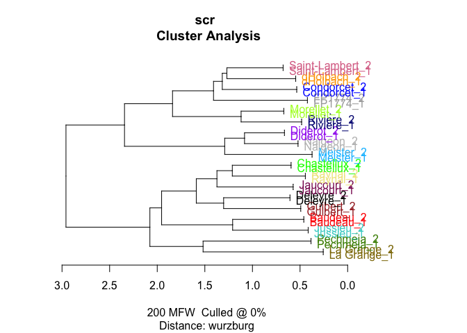
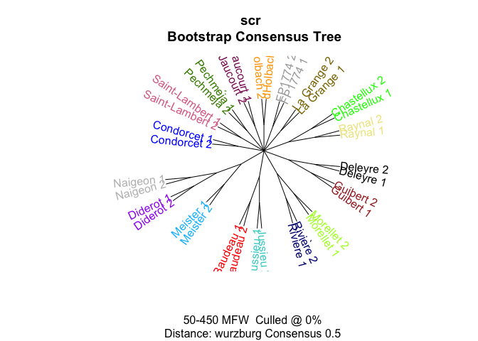
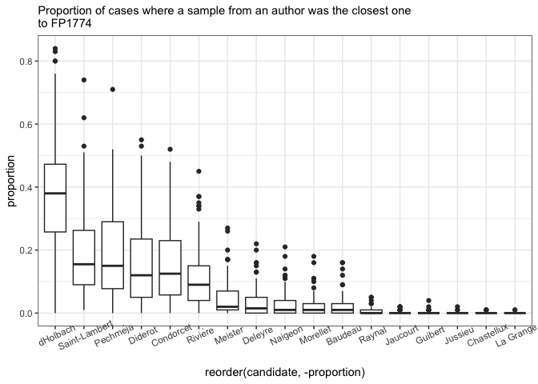
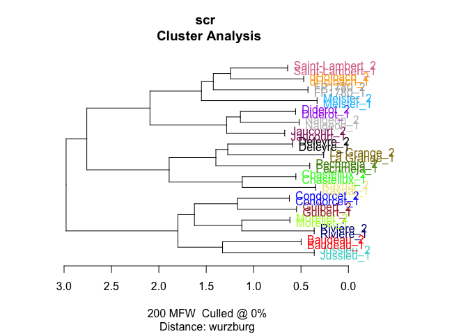
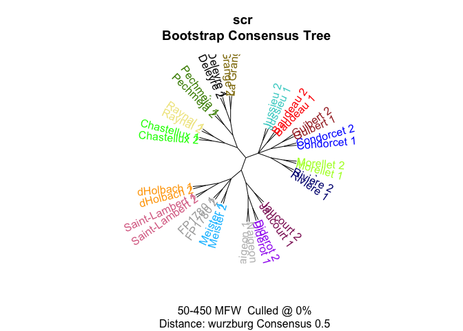
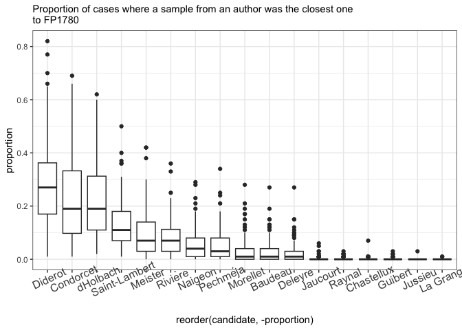
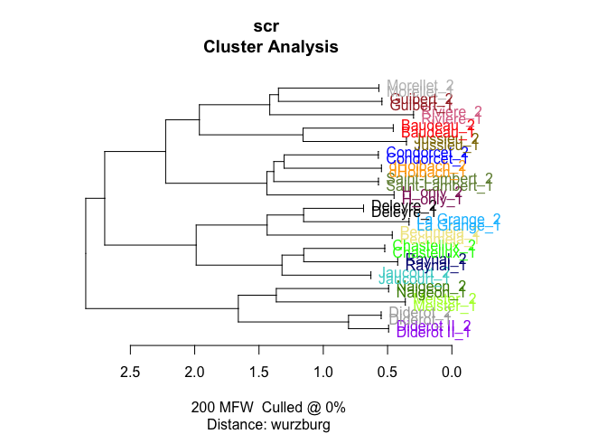
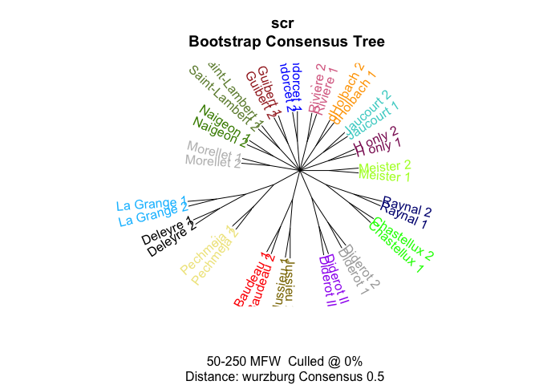
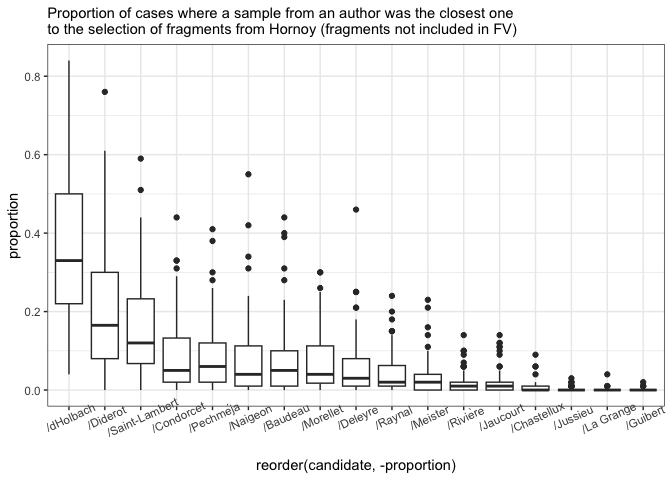

# 03_2_analysis_additional

## Additional tests for FV fragments

``` r
library(tidyverse)
library(tidytext)
library(stylo)
library(seetrees)
library(tinytex)

theme_set(theme_minimal())
library(MetBrewer)
```

Load data

``` r
corpus <- readRDS("../data/corpus_cln.Rds")

unique(corpus$author)
```

     [1] "Baudeau"                   "Chastellux"               
     [3] "Condorcet"                 "d"                        
     [5] "Deleyre"                   "Diderot II"               
     [7] "Diderot"                   "FP II (old version of FP)"
     [9] "Guibert"                   "H-FP"                     
    [11] "H-V-FP"                    "HDI(clean)"               
    [13] "Jaucourt"                  "Jussieu"                  
    [15] "Marmontel"                 "Meister"                  
    [17] "Morellet"                  "Naigeon"                  
    [19] "Pechméja"                  "Raynal"                   
    [21] "Rivière"                   "Saint-Lambert"            
    [23] "V-FP"                      "La Grange"                

``` r
corpus_tokenized <- corpus %>% 
  mutate(author = ifelse(author == "d", "dHolbach", author)) %>% 
  # remove old texts in question
  filter(!author %in% c("H-FP", "FP II (old version of FP)",
                        "H-V-FP", "V-FP", "HDI(clean)",
                        "Marmontel"))

glimpse(corpus_tokenized)
```

    Rows: 6,608,200
    Columns: 4
    $ path   <chr> "data//Baudeau_Avis .txt", "data//Baudeau_Avis .txt", "data//Ba…
    $ title  <chr> "Baudeau_Avis ", "Baudeau_Avis ", "Baudeau_Avis ", "Baudeau_Avi…
    $ author <chr> "Baudeau", "Baudeau", "Baudeau", "Baudeau", "Baudeau", "Baudeau…
    $ word   <chr> "a", "s", "a", "peuple", "sur", "son", "premier", "besoin", "pa…

``` r
# total number of tokens by each author, two samples from Diderot
corpus_tokenized %>% 
  count(author, sort = T) 
```

    # A tibble: 18 × 2
       author              n
       <chr>           <int>
     1 dHolbach      1223598
     2 Condorcet     1180934
     3 Raynal         668607
     4 Diderot II     394645
     5 Diderot        380769
     6 Guibert        351042
     7 Deleyre        320655
     8 Baudeau        297850
     9 Saint-Lambert  296834
    10 Jaucourt       257426
    11 Chastellux     246174
    12 Morellet       245226
    13 Jussieu        226997
    14 Naigeon        140696
    15 Rivière        140032
    16 La Grange      120000
    17 Pechméja        88244
    18 Meister         28471

``` r
rm(corpus)
```

Test fragments

``` r
fp1774 <- tibble(
  path = "../corpus_fragments/test_fragments/FP1774.txt",
  title = "FP1774",
  author = "FP1774",
  text = read_file(path)
) %>% 
  unnest_tokens(input = text, output = word, token = "words")

fp1780 <- tibble(
  path = "../corpus_fragments/test_fragments/FP1780.txt",
  title = "FP1780",
  author = "FP1780",
  text = read_file(path)
) %>% 
  unnest_tokens(input = text, output = word, token = "words")

h_only <- tibble(
  path = "../corpus_fragments/test_fragments/Hornoy_only.txt",
  title = "H_only",
  author = "H_only",
  text = read_file(path)
) %>% 
  unnest_tokens(input = text, output = word, token = "words")
```

``` r
nrow(fp1774)
```

    [1] 9680

``` r
nrow(fp1780)
```

    [1] 14255

``` r
nrow(h_only)
```

    [1] 18035

### fn

``` r
sample_independent_opt <- function(tokenized_df,
  n_samples,
  sample_size,
  text_var = "word",
  folder = "corpus_sampled/", overwrite=T) {


  # create a folder
  dir.create(folder)
  
  # rewrite all files in the folder if the folder existed before
  if(overwrite) {
    do.call(file.remove, list(list.files(folder, full.names = TRUE)))
  }
  
  shuff <- tokenized_df %>%
    group_by(author) %>%
    sample_n(n_samples * sample_size) %>% # sample tokens
    # to each sampled token assign randomly a sample number
    mutate(sample_x = sample( # sample = reshuffle the numbers of samples repeated below
    rep( # repeat
      1:n_samples, # the numbers of samples (1, 2, 3...)
      each = sample_size # each is sample_size times repeated
      ))) %>%
    # create a column author_sampleX
    unite(sample_id, c(author, sample_x), remove = F) %>%
    # group and paste together by sample_id (some kind of special paste with !!sym() )
    group_by(sample_id) %>%
    summarise(text = paste(!!sym(text_var), collapse = " "))
    
    # write samples
    for(i in 1:nrow(shuff)) {
    write_file(file=paste0(folder, shuff$sample_id[i],".txt"), shuff$text[i])
  }
}
```

``` r
diy_stylo <- function(folder = "corpus_sampled/",
                      mfw = 200,
                      drop_words = T,
                      feature = "word",
                      n_gram = 1) {
  
  # read the sampled texts from the folder corpus_sampled/
  # the feature is either word or charaters
  # the tokenizer returns lists of tokens for each text from the folder
  tokenized.texts = load.corpus.and.parse(
    files = list.files(folder, full.names = T),
    features = feature,
    ngram.size = n_gram
  )
  # computing a list of most frequent words (trimmed to top 2000 items):
  features = make.frequency.list(tokenized.texts, head = 2000)
  # producing a table of relative frequencies:
  data = make.table.of.frequencies(tokenized.texts, features, relative = TRUE)#[,1:mfw]
  
  
  
  # --- cleaning ---
  # remove stop words
  s_words <- str_detect(colnames(data), str_dev_words) # output is a logical vector with the positions of the 
  if(drop_words) {
    data <- data[,!s_words]
  }
  # crop mfw
  data <- data[, 1:mfw]
  # clean document names
  
  rownames(data) <- str_remove_all(rownames(data), "corpus_sampled/") # Clean Rownammes
  rownames(data) <- str_remove_all(rownames(data), "^.*?//") # clean rownames from full paths
  
  
  # output
  return(data)
}
```

## FP 1774

``` r
fp1774_corpus <- rbind(fp1774, corpus_tokenized)

fp1774_corpus <- fp1774_corpus %>% 
  mutate(author = ifelse(author == "Diderot II", "Diderot", author))
```

``` r
sample_independent_opt(tokenized_df = fp1774_corpus,
  n_samples = 2,
  sample_size = 4500)
```

    Warning in dir.create(folder): 'corpus_sampled' already exists

### stylo test

``` r
test1 <- stylo(
  gui = F,
  corpus.dir = "corpus_sampled/",
  corpus.lang = "French",
  mfw.min = 200,
  mfw.max = 200,
  analyzed.features = "w",
  ngram.size = 1,
  distance.measure = "wurzburg"
  )
```



### mfw200

``` r
test1$features.actually.used
```


    ------------------------------------------------
    features (e.g. frequent words) actually analyzed 
    ------------------------------------------------

      [1]  de            la            les           et            l             
      [6]  le            à            que           des           il            
     [11]  d             qui           qu            est           en            
     [16]  un            dans          ne            une           pour          
     [21]  on            du            par           plus          a             
     [26]  ce            n             s             se            pas           
     [31]  ou            sur           au            nous          je            
     [36]  y             ces           leur          ils           lui           
     [41]  cette         mais          son           elle          ses           
     [46]  vous          même         si            sa            avec          
     [51]  être         tout          aux           ont           comme         
     [56]  sans          sont          peut          leurs         bien          
     [61]  fait          tous          dont          point         faire         
     [66]  font          homme         autres        toutes        ni            
     [71]  encore        moins         t             où           me            
     [76]  hommes        deux          autre         avoir         elles         
     [81]  ceux          été         nos           faut          nature        
     [86]  cet           celui         étoit        dit           peu           
     [91]  toujours      grand         avoit         après        aussi         
     [96]  donc          entre         rien          doit          celle         
    [101]  toute         très         ainsi         non           fut           
    [106]  quelques      vie           dire          raison        liberté      
    [111]  ordre         quelque       jamais        parce         quand         
    [116]  ai            trop          soit          là           contre        
    [121]  notre         état         eux           mêmes        corps         
    [126]  car           mon           tant          sous          grande        
    [131]  peuple        commerce      dieu          terre         vos           
    [136]  alors         peuvent       votre         enfin         mes           
    [141]  cela          nombre        était        ma            sera          
    [146]  trois         roi           souvent       esprit        nation        
    [151]  chez          voir          assez         force         loix          
    [156]  effet         lieu          loi           premier       société     
    [161]  intérêt     partie        seroit        fit           fois          
    [166]  beaucoup      droit         général     mal           mille         
    [171]  pouvoir       chaque        jusqu         plusieurs     cependant     
    [176]  ici           mieux         avait         monde         mort          
    [181]  seul          donner        voit          peuples       temps         
    [186]  vers          eu            objet         prix          bonheur       
    [191]  choses        fort          gouvernement  avons         autant        
    [196]  pays          ans           chose         doute         guerre        

    (total number of elements:  200)

### BCT

``` r
# bootstrap consensus tree
bct <- stylo(
  gui = F,
  corpus.dir = "corpus_sampled/",
  corpus.lang = "French",
  analyzed.features = "w",
  ngram.size = 1,
  mfw.min = 50,
  mfw.max = 450,
  mfw.incr = 1,
  distance.measure = "wurzburg",
  analysis.type = "BCT",
  consensus.strength = 0.5
)
```



### Imposters

``` r
# var needed for diy fn
str_dev_words <- c("et")
```

``` r
imp_res <- vector(mode = "list")
r <- NULL
counter <- 0

for (i in 1:50) {
  
  # create samples for each trial
  sample_independent_opt(
    tokenized_df = fp1774_corpus, 
    n_samples = 2, 
    sample_size = 4500)
  
  # build doc-term matrix from the samples in the corpus_sampled folder
  data = diy_stylo(mfw = 200, 
                    feature = "word",
                    n_gram = 1)
  
  # test each of the true FV-L1 sets
  for (s in c(13, 14)) {
    
    # run imposters test
    r <- imposters(reference.set = data[-c(13, 14),], # remove test data from the ref
                   test = data[c(s),], # test one of the samples against the others
                   features = 0.5, # test 50% of the features in each trial
                   iterations = 100,
                   distance = "wurzburg"
                   )
    
    # count iterations
    counter <- counter + 1
    
    # store results
    
    imp_res[[counter]] <- tibble(candidate = names(r),
                                 proportion = r)
    
    print(counter)
  }
  
}

saveRDS(imp_res, "imp_res/impr_fp1774.rds")
```

``` r
imp_res <- readRDS("imp_res/impr_fp1774.rds")

imp_res %>%
  bind_rows() %>%  #stack all the optained prop tables into one
  mutate(candidate = str_remove(candidate, "^/")) %>% 
  ggplot(aes(x = reorder(candidate, - proportion),
  y = proportion)) +
  geom_boxplot() +
  theme_bw() + 
  labs(subtitle = "Proportion of cases where a sample from an author was the closest one\nto FP1774") +
  theme(axis.text.x = element_text(angle = 25))
```



## FP 1780

``` r
fp1780_corpus <- rbind(fp1780, corpus_tokenized) %>% 
  mutate(author = ifelse(author == "Diderot II", "Diderot", author))
```

``` r
sample_independent_opt(tokenized_df = fp1780_corpus,
  n_samples = 2,
  sample_size = 5000)
```

    Warning in dir.create(folder): 'corpus_sampled' already exists

### stylo test

``` r
test1 <- stylo(
  gui = F,
  corpus.dir = "corpus_sampled/",
  corpus.lang = "French",
  mfw.min = 200,
  mfw.max = 200,
  analyzed.features = "w",
  ngram.size = 1,
  distance.measure = "wurzburg"
  )
```



### mfw200

``` r
test1$features.actually.used
```


    ------------------------------------------------
    features (e.g. frequent words) actually analyzed 
    ------------------------------------------------

      [1]  de         la         les        et         l          le         
      [7]  à         que        des        il         d          qui        
     [13]  qu         en         est        un         dans       ne         
     [19]  une        pour       plus       du         on         n          
     [25]  par        a          ce         se         pas        s          
     [31]  ou         sur        au         je         nous       ils        
     [37]  y          mais       leur       ces        elle       lui        
     [43]  cette      si         son        vous       ses        avec       
     [49]  même      être      sa         aux        comme      sans       
     [55]  tout       peut       ont        tous       bien       sont       
     [61]  leurs      point      dont       faire      fait       font       
     [67]  où        hommes     toutes     deux       homme      autres     
     [73]  encore     ceux       ni         autre      nos        t          
     [79]  me         moins      elles      avoir      celui      faut       
     [85]  doit       étoit     cet        peu        toute      été      
     [91]  toujours   jamais     grand      dire       aussi      dit        
     [97]  donc       nature     ainsi      avoit      liberté   quelques   
    [103]  quand      celle      rien       trop       parce      après     
    [109]  très      entre      notre      fut        ai         là        
    [115]  mon        eux        corps      raison     vie        soit       
    [121]  état      non        peuple     contre     commerce   sera       
    [127]  quelque    ordre      terre      alors      lieu       partie     
    [133]  trois      était     mêmes     peuvent    prix       enfin      
    [139]  esprit     force      loix       mal        dieu       fois       
    [145]  tant       ici        guerre     mes        nombre     nation     
    [151]  seroit     votre      donner     société  bonheur    souvent    
    [157]  droit      cela       intérêt  premier    sous       temps      
    [163]  car        chaque     rendre     beaucoup   effet      jusqu      
    [169]  peuples    roi        ci         loi        monde      ait        
    [175]  autant     avait      grande     ma         vos        plusieurs  
    [181]  amour      fit        cependant  fort       objet      pays       
    [187]  seul       chez       avons      jour       assez      bon        
    [193]  religion   voir       yeux       mieux      mille      avant      
    [199]  celles     général  

    (total number of elements:  200)

### BCT

``` r
# bootstrap consensus tree
bct <- stylo(
  gui = F,
  corpus.dir = "corpus_sampled/",
  corpus.lang = "French",
  analyzed.features = "w",
  ngram.size = 1,
  mfw.min = 50,
  mfw.max = 450,
  mfw.incr = 1,
  distance.measure = "wurzburg",
  analysis.type = "BCT",
  consensus.strength = 0.5
)
```



### Imposters

``` r
imp_res <- vector(mode = "list")

counter <- 0

for (i in 1:50) {
  
  # create samples for each trial
  sample_independent_opt(
    tokenized_df = fp1780_corpus, 
    n_samples = 2, 
    sample_size = 5000)
  
  # build doc-term matrix from the samples in the corpus_sampled folder
  data = diy_stylo(mfw = 200, 
                    feature = "word",
                    n_gram = 1)
  
  # test each of the true FV-L1 sets
  for (s in c(13, 14)) {
    
    # run imposters test
    r <- imposters(reference.set = data[-c(13, 14),], # remove test data from the ref
                   test = data[c(s),], # test one of the samples against the others
                   features = 0.5, # test 50% of the features in each trial
                   iterations = 100,
                   distance = "wurzburg"
                   )
    
    # count iterations
    counter <- counter + 1
    
    # store results
    
    imp_res[[counter]] <- tibble(candidate = names(r),
                                 proportion = r)
    
    print(counter)
  }
  
}

saveRDS(imp_res, "imp_res/impr_fp1780.rds")
```

``` r
imp_res <- readRDS("imp_res/impr_fp1780.rds")

imp_res %>%
  bind_rows() %>%  #stack all the optained prop tables into one
  mutate(candidate = str_remove(candidate, "^/")) %>% 
  ggplot(aes(x = reorder(candidate, - proportion),
  y = proportion)) +
  geom_boxplot() +
  theme_bw() + 
  labs(subtitle = "Proportion of cases where a sample from an author was the closest one\nto FP1780") +
  theme(axis.text.x = element_text(angle = 25, size = 12))
```



## Hornot selection: fragments, appeared only in Hornoy

N words = 18 035

``` r
h_corpus <- rbind(h_only, corpus_tokenized)
```

``` r
sample_independent_opt(tokenized_df = h_corpus,
  n_samples = 2,
  sample_size = 5000)
```

    Warning in dir.create(folder): 'corpus_sampled' already exists

### stylo test

``` r
test1 <- stylo(
  gui = F,
  corpus.dir = "corpus_sampled/",
  corpus.lang = "French",
  mfw.min = 200,
  mfw.max = 200,
  analyzed.features = "w",
  ngram.size = 1,
  distance.measure = "wurzburg"
  )
```



``` r
test1$features.actually.used
```


    ------------------------------------------------
    features (e.g. frequent words) actually analyzed 
    ------------------------------------------------

      [1]  de         la         et         les        l          le         
      [7]  à         que        des        il         d          qui        
     [13]  qu         en         un         est        dans       ne         
     [19]  une        pour       du         n          plus       on         
     [25]  ce         par        a          se         pas        s          
     [31]  ou         sur        au         nous       je         ils        
     [37]  y          vous       ces        cette      son        elle       
     [43]  si         mais       leur       lui        même      ses        
     [49]  être      avec       aux        sans       sa         tout       
     [55]  comme      ont        bien       sont       leurs      fait       
     [61]  peut       point      tous       dont       faire      autres     
     [67]  font       homme      toutes     ni         où        me         
     [73]  moins      deux       t          hommes     autre      elles      
     [79]  été      encore     nos        ceux       avoir      cet        
     [85]  étoit     celui      avoit      nature     doit       donc       
     [91]  faut       dit        peu        toujours   après     quelques   
     [97]  entre      grand      toute      jamais     trop       aussi      
    [103]  fut        quand      contre     ai         rien       ainsi      
    [109]  corps      celle      dire       soit       non        raison     
    [115]  vie        liberté   dieu       était     mon        parce      
    [121]  mêmes     quelque    notre      grande     très      là        
    [127]  nombre     cela       état      commerce   droit      premier    
    [133]  esprit     eux        ordre      car        alors      force      
    [139]  lieu       mal        peuple     trois      votre      partie     
    [145]  tant       beaucoup   chez       nation     général  temps      
    [151]  assez      chaque     monde      enfin      jour       souvent    
    [157]  aucun      fois       jusqu      nom        sera       loix       
    [163]  seul       voir       cependant  mes        prix       fort       
    [169]  ma         donner     fit        intérêt  grands     peuvent    
    [175]  rendre     voit       bonheur    effet      trouve     mieux      
    [181]  mort       objet      tu         avoient    choses     eu         
    [187]  ici        terre      depuis     guerre     seroit     sous       
    [193]  pays       plusieurs  pouvoir    bon        âme       or         
    [199]  quel       société  

    (total number of elements:  200)

### BCT

``` r
# bootstrap consensus tree
bct <- stylo(
  gui = F,
  corpus.dir = "corpus_sampled/",
  corpus.lang = "French",
  analyzed.features = "w",
  ngram.size = 1,
  mfw.min = 50,
  mfw.max = 250,
  mfw.incr = 1,
  distance.measure = "wurzburg",
  analysis.type = "BCT",
  consensus.strength = 0.5
)
```



### Imposters

``` r
imp_res <- vector(mode = "list")

counter <- 0

for (i in 1:50) {
  
  # create samples for each trial
  sample_independent_opt(
    tokenized_df = h_corpus, 
    n_samples = 2, 
    sample_size = 5000)
  
  # build doc-term matrix from the samples in the corpus_sampled folder
  data = diy_stylo(mfw = 200, 
                    feature = "word",
                    n_gram = 1)
  
  # test each of the true FV-L1 sets
  for (s in c(15, 16)) {
    
    # run imposters test
    r <- imposters(reference.set = data[-c(15, 16),], # remove test data from the ref
                   test = data[c(s),], # test one of the samples against the others
                   features = 0.5, # test 50% of the features in each trial
                   iterations = 100,
                   distance = "wurzburg"
                   )
    
    # count iterations
    counter <- counter + 1
    
    # store results
    
    imp_res[[counter]] <- tibble(candidate = names(r),
                                 proportion = r)
    
    print(counter)
  }
  
}

saveRDS(imp_res, "imp_res/h_only_selection.rds")
```

``` r
imp_res <- readRDS("imp_res/h_only_selection.rds")

imp_res %>%
  bind_rows() %>%  #stack all the optained prop tables into one
  ggplot(aes(x = reorder(candidate, - proportion),
  y = proportion)) +
  geom_boxplot() +
  theme_bw() + 
  labs(subtitle = "Proportion of cases where a sample from an author was the closest one\nto the selection of fragments from Hornoy (fragments not included in FV)") +
  theme(axis.text.x = element_text(angle = 25))
```


