# 03_analysis

## Stylometric analysis

Some data preparation & cleaning

``` r
library(tidyverse)
library(tidytext)
library(stylo)
library(seetrees)
library(tinytex)

theme_set(theme_minimal())
library(MetBrewer)
```

### load test fragments

``` r
# editions data

l <- list.files(path = "../corpus_fragments/test_fragments/",
                pattern = "^ed",
                full.names = T)

ed <- tibble(
  path = l,
  author = str_remove_all(l, "\\.\\./corpus_fragments/test_fragments//|\\.txt"),
  title = "",
  text = sapply(path, read_file)
) %>% 
  mutate(text = str_replace_all(text, "'", " ")) %>% 
  unnest_tokens(input = text, output = word, token = "words") %>% 
  filter(!str_detect(word, "^\\d+$"))

head(ed)
```

    # A tibble: 6 × 4
      path                                                        author title word 
      <chr>                                                       <chr>  <chr> <chr>
    1 ../corpus_fragments/test_fragments//ed1770_CH1774_CH1780.t… ed177… ""    brama
    2 ../corpus_fragments/test_fragments//ed1770_CH1774_CH1780.t… ed177… ""    aime 
    3 ../corpus_fragments/test_fragments//ed1770_CH1774_CH1780.t… ed177… ""    dans 
    4 ../corpus_fragments/test_fragments//ed1770_CH1774_CH1780.t… ed177… ""    chaq…
    5 ../corpus_fragments/test_fragments//ed1770_CH1774_CH1780.t… ed177… ""    pays 
    6 ../corpus_fragments/test_fragments//ed1770_CH1774_CH1780.t… ed177… ""    la   

``` r
# pencil / ink data

l <- list.files(path = "../corpus_fragments/test_fragments/",
                pattern = "^ink|^pencil",
                full.names = T
                )

ink_pencil <- tibble(
  path = l,
  author = str_remove_all(l, "\\.\\./corpus_fragments/test_fragments//|\\.txt"),
  title = "",
  text = sapply(path, read_file)
) %>% 
  mutate(text = str_replace_all(text, "'", " ")) %>% 
  unnest_tokens(input = text, output = word, token = "words") %>% 
  filter(!str_detect(word, "^\\d+$"))

# likely Diderot's book chunks from FV recombination
l <- list.files(path = "../corpus_fragments/test_fragments/",
                pattern = "^diderot",
                full.names = T
                )

diderot <- tibble(
  path = l,
  author = str_remove_all(l, "\\.\\./corpus_fragments/test_fragments//|\\.txt"),
  title = "",
  text = sapply(path, read_file)
) %>% 
  mutate(text = str_replace_all(text, "'", " ")) %>% 
  unnest_tokens(input = text, output = word, token = "words") %>% 
  filter(!str_detect(word, "^\\d+$"))
```

Number of words in each test fragment

    [1] "Number of words in different editions chunks:"

    # A tibble: 7 × 2
      author                     n
      <chr>                  <int>
    1 ed1780                 63329
    2 ed1774_CH1780          15967
    3 ed1770_nch1774_CH1780  13747
    4 ed1774_nch1780         12861
    5 ed1770_CH1774_CH1780   12317
    6 ed1770_nch1774_nch1780  9240
    7 ed1770_CH1774_nch1780   5520

    [1] "Number of words in different Pensées detachées / Mélanges (pencil/ink) chunks:"

    # A tibble: 3 × 2
      author                         n
      <chr>                      <int>
    1 pencil_pensees_detachees   76498
    2 ink_melanges               56472
    3 ink_melanges_not-in-pencil 40057

    [1] "Number of words in recombined likely-Diderots FV chunks:"

    # A tibble: 4 × 2
      author                n
      <chr>             <int>
    1 diderot_fv_l5_l13 13292
    2 diderot_fv_l5_l12 12928
    3 diderot_fv_l4_l13  8659
    4 diderot_fv_l4_l12  8295

### load corpus

Test corpus is the same as before in Julian’s latest tests.

``` r
corpus <- readRDS("../data/corpus_cln.Rds")

unique(corpus$author)
```

     [1] "Baudeau"                   "Chastellux"               
     [3] "Condorcet"                 "d"                        
     [5] "Deleyre"                   "Diderot II"               
     [7] "Diderot"                   "FP II (old version of FP)"
     [9] "Guibert"                   "H-FP"                     
    [11] "H-V-FP"                    "HDI(clean)"               
    [13] "Jaucourt"                  "Jussieu"                  
    [15] "Marmontel"                 "Meister"                  
    [17] "Morellet"                  "Naigeon"                  
    [19] "Pechméja"                  "Raynal"                   
    [21] "Rivière"                   "Saint-Lambert"            
    [23] "V-FP"                      "La Grange"                

``` r
corpus_tokenized <- corpus %>% 
  mutate(author = ifelse(author == "d", "dHolbach", author)) %>% 
  # combine two Diderot's samples to one
  mutate(author = ifelse(author == "Diderot II", "Diderot", author)) %>% 
  # remove old texts in question
  filter(!author %in% c("H-FP", "FP II (old version of FP)",
                        "H-V-FP", "V-FP", "HDI(clean)",
                        "Marmontel"))

glimpse(corpus_tokenized)
```

    Rows: 6,608,200
    Columns: 4
    $ path   <chr> "data//Baudeau_Avis .txt", "data//Baudeau_Avis .txt", "data//Ba…
    $ title  <chr> "Baudeau_Avis ", "Baudeau_Avis ", "Baudeau_Avis ", "Baudeau_Avi…
    $ author <chr> "Baudeau", "Baudeau", "Baudeau", "Baudeau", "Baudeau", "Baudeau…
    $ word   <chr> "a", "s", "a", "peuple", "sur", "son", "premier", "besoin", "pa…

``` r
# total number of tokens by each author, two samples from Diderot
corpus_tokenized %>% 
  count(author, sort = T) 
```

    # A tibble: 17 × 2
       author              n
       <chr>           <int>
     1 dHolbach      1223598
     2 Condorcet     1180934
     3 Diderot        775414
     4 Raynal         668607
     5 Guibert        351042
     6 Deleyre        320655
     7 Baudeau        297850
     8 Saint-Lambert  296834
     9 Jaucourt       257426
    10 Chastellux     246174
    11 Morellet       245226
    12 Jussieu        226997
    13 Naigeon        140696
    14 Rivière        140032
    15 La Grange      120000
    16 Pechméja        88244
    17 Meister         28471

``` r
rm(corpus)
```

### fn

Working functions

#### sample ind opt

``` r
sample_independent_opt <- function(tokenized_df,
  n_samples,
  sample_size,
  text_var = "word",
  folder = "corpus_sampled/", overwrite=T) {


  # create a folder
  dir.create(folder)
  
  # rewrite all files in the folder if the folder existed before
  if(overwrite) {
    do.call(file.remove, list(list.files(folder, full.names = TRUE)))
  }
  
  shuff <- tokenized_df %>%
    group_by(author) %>%
    sample_n(n_samples * sample_size) %>% # sample tokens
    # to each sampled token assign randomly a sample number
    mutate(sample_x = sample( # sample = reshuffle the numbers of samples repeated below
    rep( # repeat
      1:n_samples, # the numbers of samples (1, 2, 3...)
      each = sample_size # each is sample_size times repeated
      ))) %>%
    # create a column author_sampleX
    unite(sample_id, c(author, sample_x), remove = F) %>%
    # group and paste together by sample_id (some kind of special paste with !!sym() )
    group_by(sample_id) %>%
    summarise(text = paste(!!sym(text_var), collapse = " "))
    
    # write samples
    for(i in 1:nrow(shuff)) {
    write_file(file=paste0(folder, shuff$sample_id[i],".txt"), shuff$text[i])
  }
}
```

#### diy stylo for imposters

``` r
diy_stylo <- function(folder = "corpus_sampled/",
                      mfw = 200,
                      drop_words = T,
                      feature = "word",
                      n_gram = 1) {
  
  # read the sampled texts from the folder corpus_sampled/
  # the feature is either word or charaters
  # the tokenizer returns lists of tokens for each text from the folder
  tokenized.texts = load.corpus.and.parse(
    files = list.files(folder, full.names = T),
    features = feature,
    ngram.size = n_gram
  )
  # computing a list of most frequent words (trimmed to top 2000 items):
  features = make.frequency.list(tokenized.texts, head = 2000)
  # producing a table of relative frequencies:
  data = make.table.of.frequencies(tokenized.texts, features, relative = TRUE)#[,1:mfw]
  
  
  
  # --- cleaning ---
  # remove stop words
  s_words <- str_detect(colnames(data), str_dev_words) # output is a logical vector with the positions of the 
  if(drop_words) {
    data <- data[,!s_words]
  }
  # crop mfw
  data <- data[, 1:mfw]
  # clean document names
  
  rownames(data) <- str_remove_all(rownames(data), "corpus_sampled/") # Clean Rownammes
  rownames(data) <- str_remove_all(rownames(data), "^.*?//") # clean rownames from full paths
  
  
  # output
  return(data)
}
```

## PART I. Editions of 1770, 1774 & 1780

Bind corpus & test fragments together.

**DATA**

The fragments were selected as follows:

-   using the metadata compiled by Julian, there are three tags for each
    fragment

    -   1770 edition: appeared / not appeared

    -   1774 edition: appeared / not appeared / changed / not changed

    -   1780 edition: appeared / changed / not changed

-   consequently, all the fragments were divided into 7 groups:

    -   appeared 1770 - not changed 1774 - not changed 1780

    -   appeared 1770 - changed 1774 - not changed 1780

    -   appeared 1770 - not changed 1774 - changed 1780

    -   appeared 1770 - changed 1774 - changed 1780

    -   appeared 1774 - not changed 1780

    -   appeared 1774 - changed 1780

    -   appeared 1780

-   based on these criteria, the fragments were combined into one text
    file which is used for the analysis below as a test text.

Below I will first look into the position of a test fragment on the
stylo() tree, then impostors are used for a more robust results.

``` r
unique(ed$author)
```

    [1] "ed1770_CH1774_CH1780"   "ed1770_CH1774_nch1780"  "ed1770_nch1774_CH1780" 
    [4] "ed1770_nch1774_nch1780" "ed1774_CH1780"          "ed1774_nch1780"        
    [7] "ed1780"                

``` r
ed %>% count(author, sort = T)
```

    # A tibble: 7 × 2
      author                     n
      <chr>                  <int>
    1 ed1780                 63329
    2 ed1774_CH1780          15967
    3 ed1770_nch1774_CH1780  13747
    4 ed1774_nch1780         12861
    5 ed1770_CH1774_CH1780   12317
    6 ed1770_nch1774_nch1780  9240
    7 ed1770_CH1774_nch1780   5520

``` r
ed_corpus <- rbind(corpus_tokenized, ed)
```

### fast stylo tests

#### 1770 & unchanged in 1774 & 1780

ed1770_nch1774_nch1780 : 8600 words

``` r
sample_independent_opt(tokenized_df = ed_corpus %>% 
                         filter(!author %in% c("ed1770_CH1774_CH1780", 
                                               "ed1770_CH1774_nch1780", 
                                               "ed1770_nch1774_CH1780", 
                                               #"ed1770_nch1774_nch1780", 
                                               "ed1774_CH1780", 
                                               "ed1774_nch1780", 
                                               "ed1780")),
  n_samples = 2,
  sample_size = 4000)
```

    Warning in dir.create(folder): 'corpus_sampled' already exists

stylo tree

``` r
test1 <- stylo(
  gui = F,
  corpus.dir = "corpus_sampled/",
  corpus.lang = "French",
  mfw.min = 200,
  mfw.max = 200,
  analyzed.features = "w",
  ngram.size = 1,
  distance.measure = "wurzburg"
  )
```

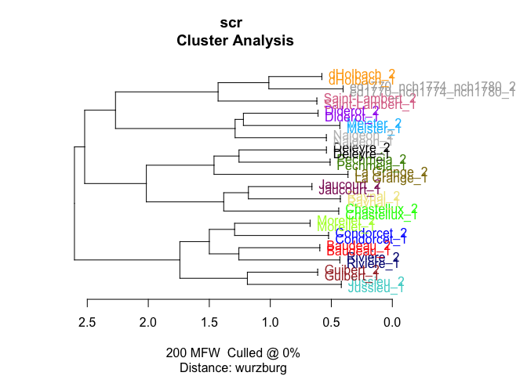

BCT

``` r
# bootstrap consensus tree
bct <- stylo(
  gui = F,
  corpus.dir = "corpus_sampled/",
  corpus.lang = "French",
  analyzed.features = "w",
  ngram.size = 1,
  mfw.min = 50,
  mfw.max = 250,
  mfw.incr = 1,
  distance.measure = "wurzburg",
  analysis.type = "BCT",
  consensus.strength = 0.5
)
```

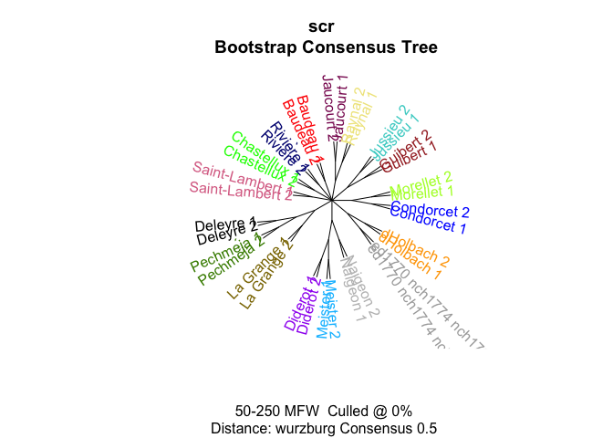

This situation is characteristic for most of the test samples from the
editions. It is basically saying that neither author is on the same
author-closeness levels as two samples from Diderot, however the closest
neighbor for text in question is d’Holbach. It is though too long
distance to say that he is the author, more likely there is some
genre/topic similarity.

Some more trees below:

#### 1770 & changed in 1774 , but not changed in 1780

very small fragment: ed1770_CH1774_nch1780 - 5k words

=\> likely random results

``` r
sample_independent_opt(tokenized_df = ed_corpus %>% 
                         filter(!author %in% c("ed1770_CH1774_CH1780", 
                                               #"ed1770_CH1774_nch1780", 
                                               "ed1770_nch1774_CH1780", 
                                               "ed1770_nch1774_nch1780", 
                                               "ed1774_CH1780", 
                                               "ed1774_nch1780", 
                                               "ed1780")),
  n_samples = 2,
  sample_size = 2500)
```

    Warning in dir.create(folder): 'corpus_sampled' already exists

``` r
test1 <- stylo(
  gui = F,
  corpus.dir = "corpus_sampled/",
  corpus.lang = "French",
  mfw.min = 200,
  mfw.max = 200,
  analyzed.features = "w",
  ngram.size = 1,
  distance.measure = "wurzburg"
  )
```

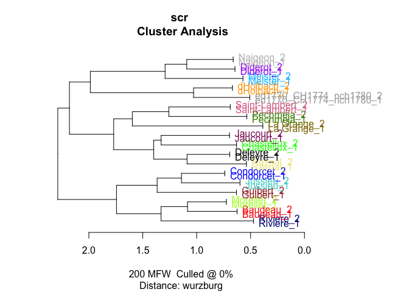

#### 1770, not changed 1774, changed 1780

ed1770_nch1774_CH178: 12 800

``` r
sample_independent_opt(tokenized_df = ed_corpus %>% 
                         filter(!author %in% c("ed1770_CH1774_CH1780", 
                                               "ed1770_CH1774_nch1780", 
                                               #"ed1770_nch1774_CH1780", 
                                               "ed1770_nch1774_nch1780", 
                                               "ed1774_CH1780", 
                                               "ed1774_nch1780", 
                                               "ed1780", 
                                               "dHolbach")),
  n_samples = 2,
  sample_size = 4000)

test1 <- stylo(
  gui = F,
  corpus.dir = "corpus_sampled/",
  corpus.lang = "French",
  mfw.min = 200,
  mfw.max = 200,
  analyzed.features = "w",
  ngram.size = 1,
  distance.measure = "wurzburg"
  )
```

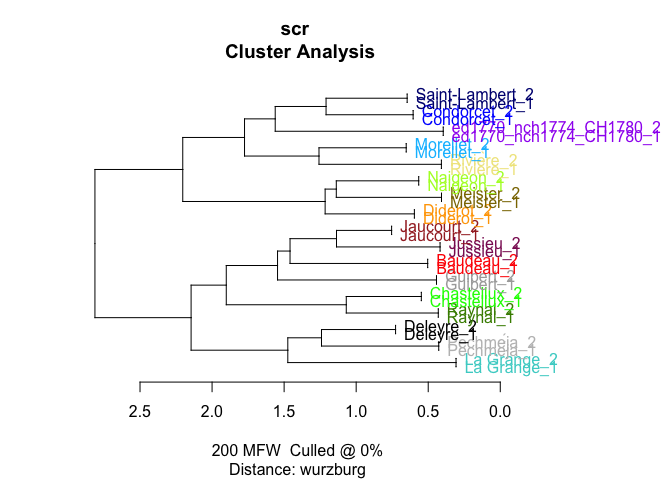

##### important

This sample showed something different from others.

#### 1770, changed twice in 1774 & 1780

ed1770_CH1774_CH1780: 11 499 words

``` r
sample_independent_opt(tokenized_df = ed_corpus %>% 
                         filter(!author %in% c(#"ed1770_CH1774_CH1780", 
                                               "ed1770_CH1774_nch1780", 
                                               "ed1770_nch1774_CH1780", 
                                               "ed1770_nch1774_nch1780", 
                                               "ed1774_CH1780", 
                                               "ed1774_nch1780", 
                                               "ed1780")),
  n_samples = 2,
  sample_size = 5000)
```

    Warning in dir.create(folder): 'corpus_sampled' already exists

``` r
test1 <- stylo(
  gui = F,
  corpus.dir = "corpus_sampled/",
  corpus.lang = "French",
  mfw.min = 200,
  mfw.max = 200,
  analyzed.features = "w",
  ngram.size = 1,
  distance.measure = "wurzburg"
  )
```

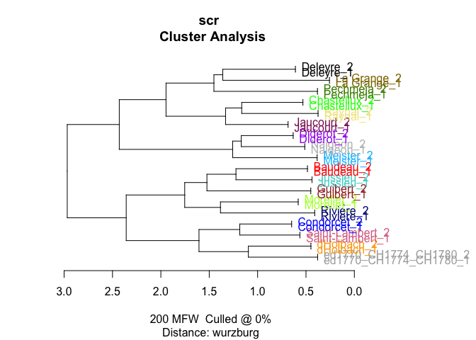

#### 1774, not changed in 1780

ed1774_nch1780: 12 000 words

``` r
sample_independent_opt(tokenized_df = ed_corpus %>% 
                         filter(!author %in% c("ed1770_CH1774_CH1780", 
                                               "ed1770_CH1774_nch1780", 
                                               "ed1770_nch1774_CH1780", 
                                               "ed1770_nch1774_nch1780", 
                                               "ed1774_CH1780", 
                                               # "ed1774_nch1780", 
                                               "ed1780")),
  n_samples = 2,
  sample_size = 4000)

test1 <- stylo(
  gui = F,
  corpus.dir = "corpus_sampled/",
  corpus.lang = "French",
  mfw.min = 200,
  mfw.max = 200,
  analyzed.features = "w",
  ngram.size = 1,
  distance.measure = "wurzburg"
  )
```

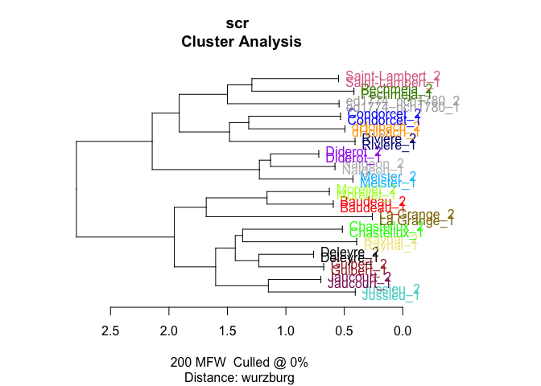

``` r
# bootstrap consensus tree
bct <- stylo(
  gui = F,
  corpus.dir = "corpus_sampled/",
  corpus.lang = "French",
  analyzed.features = "w",
  ngram.size = 1,
  mfw.min = 50,
  mfw.max = 250,
  mfw.incr = 1,
  distance.measure = "wurzburg",
  analysis.type = "BCT",
  consensus.strength = 0.5
)
```

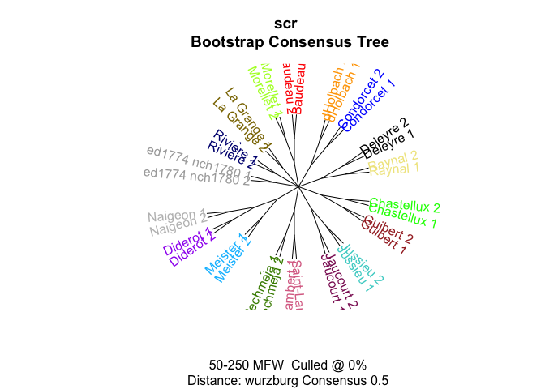

##### important

In this case in many iterations the nearest neighbor is not d’Holbach,
but Pechmeja or Saint-Lambert.

#### 1774 & changed in 1780

ed1774_CH1780: 14 918 words

``` r
sample_independent_opt(tokenized_df = ed_corpus %>% 
                         filter(!author %in% c("ed1770_CH1774_CH1780", 
                                               "ed1770_CH1774_nch1780", 
                                               "ed1770_nch1774_CH1780", 
                                               "ed1770_nch1774_nch1780", 
                                               #"ed1774_CH1780", 
                                               "ed1774_nch1780", 
                                               "ed1780")),
  n_samples = 2,
  sample_size = 4000)

test1 <- stylo(
  gui = F,
  corpus.dir = "corpus_sampled/",
  corpus.lang = "French",
  mfw.min = 200,
  mfw.max = 200,
  analyzed.features = "w",
  ngram.size = 1,
  distance.measure = "wurzburg"
  )
```

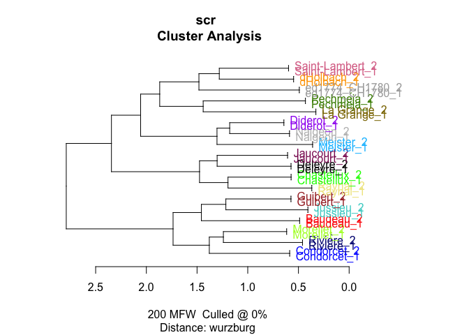

#### 1780

ed1780: 58 868

``` r
sample_independent_opt(tokenized_df = ed_corpus %>% 
                         filter(!author %in% c("ed1770_CH1774_CH1780", 
                                               "ed1770_CH1774_nch1780", 
                                               "ed1770_nch1774_CH1780", 
                                               "ed1770_nch1774_nch1780", 
                                               "ed1774_CH1780", 
                                               "ed1774_nch1780"#, 
                                               #"ed1780"
                                               )),
  n_samples = 2,
  sample_size = 4000)

test1 <- stylo(
  gui = F,
  corpus.dir = "corpus_sampled/",
  corpus.lang = "French",
  mfw.min = 200,
  mfw.max = 200,
  analyzed.features = "w",
  ngram.size = 1,
  distance.measure = "wurzburg"
  )
```

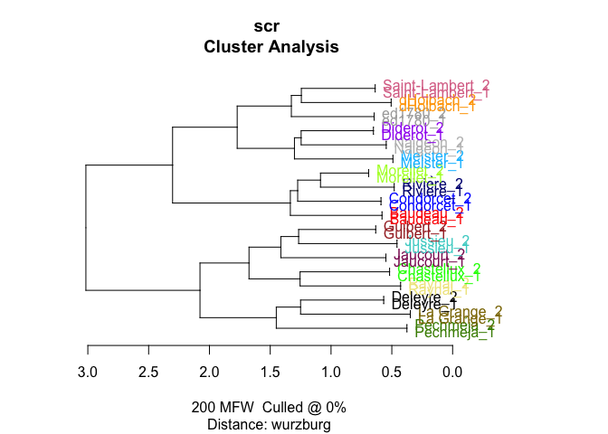

#### check strongwords

Check on a random tree if there is a strong bias in the main branches of
the tree: seems fine.

``` r
view_tree(test1, k = 2)
```

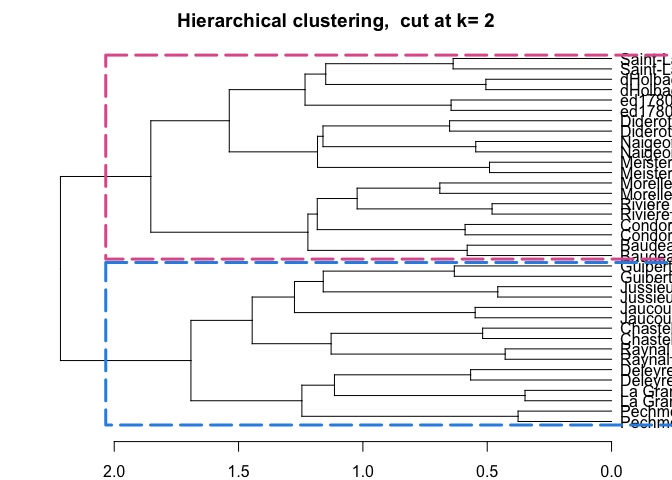

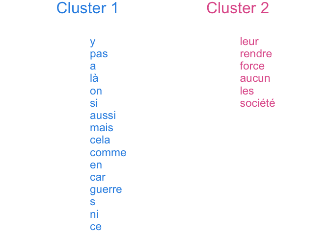

### imposters

#### 1770 unchanged

``` r
# var needed for diy fn
str_dev_words <- c("et")
```

``` r
imp_res <- vector(mode = "list")

counter <- 0

for (i in 1:50) {
  
  # create samples for each trial
  sample_independent_opt(
    tokenized_df = ed_corpus %>% 
                         filter(!author %in% c("ed1770_CH1774_CH1780", 
                                               "ed1770_CH1774_nch1780", 
                                               "ed1770_nch1774_CH1780", 
                                               #"ed1770_nch1774_nch1780", 
                                               "ed1774_CH1780", 
                                               "ed1774_nch1780", 
                                               "ed1780"
                                               )), 
    n_samples = 2, 
    sample_size = 4000)
  
  # build doc-term matrix from the samples in the corpus_sampled folder
  data = diy_stylo(mfw = 200, 
                    feature = "word",
                    n_gram = 1)
  
  # test each of the true FV-L1 sets
  for (s in c(13, 14)) {
    
    # run imposters test
    r <- imposters(reference.set = data[-c(13, 14),], # remove test data from the ref
                   test = data[c(s),], # test one of the samples against the others
                   features = 0.5, # test 50% of the features in each trial
                   iterations = 100,
                   distance = "wurzburg"
                   )
    
    # count iterations
    counter <- counter + 1
    
    # store results
    
    imp_res[[counter]] <- tibble(candidate = names(r),
                                 proportion = r)
    
    print(counter)
  }
  
}

saveRDS(imp_res, "imp_res/impr_1770_nch74_nch80_2.rds")
```

``` r
imp_res <- readRDS("imp_res/impr_1770_nch74_nch80_2.rds")

imp_res %>%
  bind_rows() %>%  #stack all the optained prop tables into one
  ggplot(aes(x = reorder(candidate, - proportion),
  y = proportion)) +
  geom_boxplot() +
  theme_bw() + 
  labs(subtitle = "Proportion of cases where a sample from an author was the closest one\nto FV text from 1770 that stayed unchanged in later editions (1774 & 1780)") +
  theme(axis.text.x = element_text(angle = 25))
```

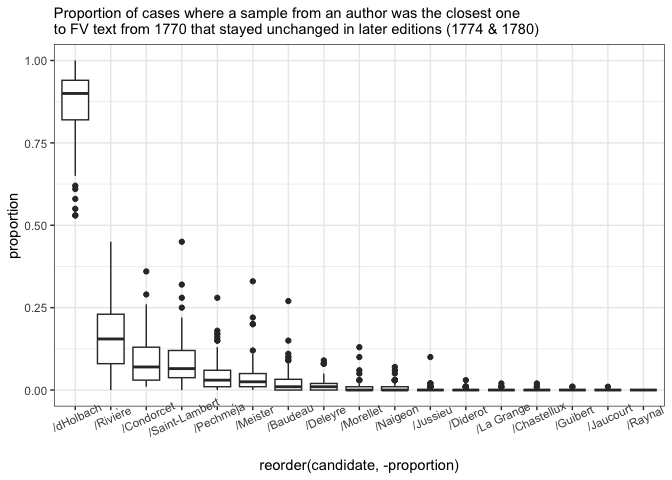

#### Check: d’Holbach writings separated

Below I am taking d’Holbach’s texts as separate files in order to check
if there is one text which has a very strong signal that drives the
similarity. It is also important to check if d’Holbach’s authorial
signal itself is strong and not diffused to other authors.

``` r
glimpse(ed_corpus)
```

    Rows: 6,741,181
    Columns: 4
    $ path   <chr> "data//Baudeau_Avis .txt", "data//Baudeau_Avis .txt", "data//Ba…
    $ title  <chr> "Baudeau_Avis ", "Baudeau_Avis ", "Baudeau_Avis ", "Baudeau_Avi…
    $ author <chr> "Baudeau", "Baudeau", "Baudeau", "Baudeau", "Baudeau", "Baudeau…
    $ word   <chr> "a", "s", "a", "peuple", "sur", "son", "premier", "besoin", "pa…

``` r
#unique(ed_corpus$title)

t <- ed_corpus %>% 
  mutate(author = ifelse(author == "dHolbach", title, author),
         author = str_replace(author, "d_Holbach_", "dHolbach_"))

t %>% 
  count(author, sort = T) %>% tail
```

    # A tibble: 6 × 2
      author                                 n
      <chr>                              <int>
    1 ed1770_nch1774_CH1780              13747
    2 ed1774_nch1780                     12861
    3 ed1770_CH1774_CH1780               12317
    4 ed1770_nch1774_nch1780              9240
    5 ed1770_CH1774_nch1780               5520
    6 dHolbach_Essai sur l_art de ramper  2127

``` r
t <- t %>% 
  filter(!str_detect(author, "dHolbach_Essai") & 
           !str_detect(author, "dHolbach_L_Antiquit"))
```

``` r
sample_independent_opt(tokenized_df = t %>% 
                         filter(!author %in% c("ed1770_CH1774_CH1780", 
                                               "ed1770_CH1774_nch1780", 
                                               "ed1770_nch1774_CH1780", 
                                               #"ed1770_nch1774_nch1780", 
                                               "ed1774_CH1780", 
                                               "ed1774_nch1780", 
                                               "ed1780"
                                               )),
  n_samples = 2,
  sample_size = 4000)

test1 <- stylo(
  gui = F,
  corpus.dir = "corpus_sampled/",
  corpus.lang = "French",
  mfw.min = 200,
  mfw.max = 200,
  analyzed.features = "w",
  ngram.size = 1,
  distance.measure = "wurzburg"
  )
```

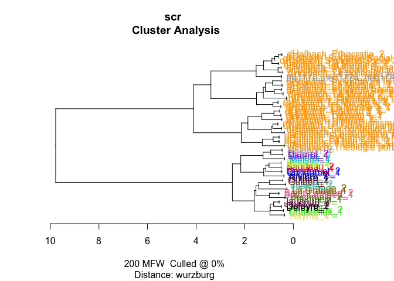

``` r
dtm <- diy_stylo(
  folder = "corpus_sampled/",
  mfw = 200,
  drop_words = F)
```

    using current directory...

    slicing input text into tokens...


    turning words into features, e.g. char n-grams (if applicable)...

    processing  76  text samples

    .......
    combining frequencies into a table...

``` r
grep("ed", rownames(dtm))
```

    [1] 53 54

``` r
imposters(reference.set = dtm[-c(55, 56), ],
  test = dtm[55,],
  features = 0.5,
  iterations = 100,
  distance = "wurzburg"
)
```

    No candidate set specified; testing the following classes (one at a time):
      /Baudeau   /Chastellux   /Condorcet   /Deleyre   /dHolbach   /Diderot   /ed1770   /Jaucourt   /Jussieu   /La Grange   /Meister   /Morellet   /Naigeon   /Pechméja   /Raynal   /Rivière   /Saint-Lambert
     

    Testing a given candidate against imposters...

    /Baudeau     0.02
    /Chastellux      0.26
    /Condorcet   0.01
    /Deleyre     0.02
    /dHolbach    0
    /Diderot     0.06
    /ed1770      0
    /Jaucourt    0.04
    /Jussieu     0.84
    /La Grange   0
    /Meister     0
    /Morellet    0.05
    /Naigeon     0
    /Pechméja   0.02
    /Raynal      0.01
    /Rivière    0.04
    /Saint-Lambert   0.01

          /Baudeau    /Chastellux     /Condorcet       /Deleyre      /dHolbach 
              0.02           0.26           0.01           0.02           0.00 
          /Diderot        /ed1770      /Jaucourt       /Jussieu     /La Grange 
              0.06           0.00           0.04           0.84           0.00 
          /Meister      /Morellet       /Naigeon      /Pechméja        /Raynal 
              0.00           0.05           0.00           0.02           0.01 
          /Rivière /Saint-Lambert 
              0.04           0.01 

``` r
imposters(reference.set = dtm[-c(55, 56), ],
  test = dtm[56,],
  features = 0.5,
  iterations = 100,
  distance = "wurzburg"
)
```

    No candidate set specified; testing the following classes (one at a time):
      /Baudeau   /Chastellux   /Condorcet   /Deleyre   /dHolbach   /Diderot   /ed1770   /Jaucourt   /Jussieu   /La Grange   /Meister   /Morellet   /Naigeon   /Pechméja   /Raynal   /Rivière   /Saint-Lambert
     

    Testing a given candidate against imposters...

    /Baudeau     0
    /Chastellux      0.02
    /Condorcet   0.08
    /Deleyre     0.11
    /dHolbach    0
    /Diderot     0.04
    /ed1770      0
    /Jaucourt    0.44
    /Jussieu     0.53
    /La Grange   0.02
    /Meister     0
    /Morellet    0.05
    /Naigeon     0.01
    /Pechméja   0.12
    /Raynal      0.06
    /Rivière    0.02
    /Saint-Lambert   0.04

          /Baudeau    /Chastellux     /Condorcet       /Deleyre      /dHolbach 
              0.00           0.02           0.08           0.11           0.00 
          /Diderot        /ed1770      /Jaucourt       /Jussieu     /La Grange 
              0.04           0.00           0.44           0.53           0.02 
          /Meister      /Morellet       /Naigeon      /Pechméja        /Raynal 
              0.00           0.05           0.01           0.12           0.06 
          /Rivière /Saint-Lambert 
              0.02           0.04 

It seems that the corpus overall works fine and there is no actual
issues with d’Holbach’s set of works (at least I don’t see it at the
moment).

#### 1770-ch 1774-nch 1780

``` r
sample_independent_opt(tokenized_df = ed_corpus %>% 
                         filter(!author %in% c("ed1770_CH1774_CH1780", 
                                               # "ed1770_CH1774_nch1780", 
                                               "ed1770_nch1774_CH1780", 
                                               "ed1770_nch1774_nch1780", 
                                               "ed1774_CH1780", 
                                               "ed1774_nch1780", 
                                               "ed1780"
                                               )),
  n_samples = 2,
  sample_size = 2500)

dtm <- diy_stylo(
  folder = "corpus_sampled/",
  mfw = 200,
  drop_words = F)

grep("ed", rownames(dtm))
```

``` r
imp_res <- vector(mode = "list")

counter <- 0

for (i in 1:50) {
  
  # create samples for each trial
  sample_independent_opt(
    tokenized_df = ed_corpus %>% 
                         filter(!author %in% c("ed1770_CH1774_CH1780", 
                                               # "ed1770_CH1774_nch1780", 
                                               "ed1770_nch1774_CH1780", 
                                               "ed1770_nch1774_nch1780", 
                                               "ed1774_CH1780", 
                                               "ed1774_nch1780", 
                                               "ed1780"
                                               )), 
    n_samples = 2, 
    sample_size = 2500)
  
  # build doc-term matrix from the samples in the corpus_sampled folder
  data = diy_stylo(mfw = 200, 
                    feature = "word",
                    n_gram = 1)
  
  # test each of the true FV-L1 sets
  for (s in c(15, 16)) {
    
    # run imposters test
    r <- imposters(reference.set = data[-c(15, 16),], # remove test data from the ref
                   test = data[c(s),], # test one of the samples against the others
                   features = 0.5, # test 50% of the features in each trial
                   iterations = 100,
                   distance = "wurzburg"
                   )
    
    # count iterations
    counter <- counter + 1
    
    # store results
    
    imp_res[[counter]] <- tibble(candidate = names(r),
                                 proportion = r)
    
    print(counter)
  }
  
}

saveRDS(imp_res, "imp_res/impr_1770_ch74_nch80.rds")
```

``` r
imp_res <- readRDS("imp_res/impr_1770_ch74_nch80.rds")

imp_res %>%
  bind_rows() %>%  #stack all the optained prop tables into one
  ggplot(aes(x = reorder(candidate, - proportion),
  y = proportion)) +
  geom_boxplot() +
  theme_bw() + 
  labs(subtitle = "Proportion of cases where a sample from an author was the closest one\nto FV text from 1770 that was changed in the ed. of 1774 and not changed in the ed. of 1780 ") +
  theme(axis.text.x = element_text(angle = 25))
```

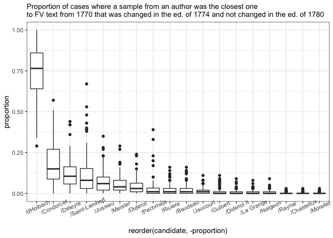

#### 1770-ch1774-ch1780

``` r
sample_independent_opt(tokenized_df = ed_corpus %>% 
                         filter(!author %in% c(#"ed1770_CH1774_CH1780", 
                                               "ed1770_CH1774_nch1780", 
                                               "ed1770_nch1774_CH1780", 
                                               "ed1770_nch1774_nch1780", 
                                               "ed1774_CH1780", 
                                               "ed1774_nch1780", 
                                               "ed1780"
                                               )),
  n_samples = 2,
  sample_size = 5000)

dtm <- diy_stylo(
  folder = "corpus_sampled/",
  mfw = 200,
  drop_words = F)

dim(dtm)

grep("ed", rownames(dtm))
```

``` r
imp_res <- vector(mode = "list")

counter <- 0

for (i in 1:50) {
  
  # create samples for each trial
  sample_independent_opt(
    tokenized_df = ed_corpus %>% 
                         filter(!author %in% c(#"ed1770_CH1774_CH1780", 
                                               "ed1770_CH1774_nch1780", 
                                               "ed1770_nch1774_CH1780", 
                                               "ed1770_nch1774_nch1780", 
                                               "ed1774_CH1780", 
                                               "ed1774_nch1780", 
                                               "ed1780"
                                               )), 
    n_samples = 2, 
    sample_size = 5000)
  
  # build doc-term matrix from the samples in the corpus_sampled folder
  data = diy_stylo(mfw = 200, 
                    feature = "word",
                    n_gram = 1)
  
  # test each of the true FV-L1 sets
  for (s in c(15, 16)) {
    
    # run imposters test
    r <- imposters(reference.set = data[-c(15, 16),], # remove test data from the ref
                   test = data[c(s),], # test one of the samples against the others
                   features = 0.5, # test 50% of the features in each trial
                   iterations = 100,
                   distance = "wurzburg"
                   )
    
    # count iterations
    counter <- counter + 1
    
    # store results
    
    imp_res[[counter]] <- tibble(candidate = names(r),
                                 proportion = r)
    
    print(counter)
  }
  
}

saveRDS(imp_res, "imp_res/impr_1770_ch74_ch80.rds")
```

``` r
imp_res <- readRDS("imp_res/impr_1770_ch74_ch80.rds")

imp_res %>%
  bind_rows() %>%  #stack all the optained prop tables into one
  ggplot(aes(x = reorder(candidate, - proportion),
  y = proportion)) +
  geom_boxplot() +
  theme_bw() + 
  labs(subtitle = "Proportion of cases where a sample from an author was the closest one\nto FV text from 1770 that was changed twice in the ed. of 1774 and that of 1780 ") +
  theme(axis.text.x = element_text(angle = 25))
```

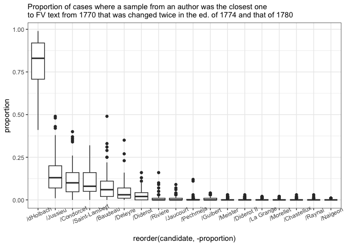

#### 1770-nch1774-ch1780

``` r
sample_independent_opt(tokenized_df = ed_corpus %>% 
                         filter(!author %in% c("ed1770_CH1774_CH1780", 
                                               "ed1770_CH1774_nch1780", 
                                               #"ed1770_nch1774_CH1780", 
                                               "ed1770_nch1774_nch1780", 
                                               "ed1774_CH1780", 
                                               "ed1774_nch1780", 
                                               "ed1780"
                                               )),
  n_samples = 2,
  sample_size = 5000)

dtm <- diy_stylo(
  folder = "corpus_sampled/",
  mfw = 200,
  drop_words = F)

dim(dtm)

grep("ed", rownames(dtm))

imp_res <- vector(mode = "list")

counter <- 0

for (i in 1:50) {
  
  # create samples for each trial
  sample_independent_opt(
    tokenized_df = ed_corpus %>% 
                         filter(!author %in% c("ed1770_CH1774_CH1780", 
                                               "ed1770_CH1774_nch1780", 
                                               #"ed1770_nch1774_CH1780", 
                                               "ed1770_nch1774_nch1780", 
                                               "ed1774_CH1780", 
                                               "ed1774_nch1780", 
                                               "ed1780"
                                               )), 
    n_samples = 2, 
    sample_size = 5000)
  
  # build doc-term matrix from the samples in the corpus_sampled folder
  data = diy_stylo(mfw = 200, 
                    feature = "word",
                    n_gram = 1)
  
  # test each of the true FV-L1 sets
  for (s in c(15, 16)) {
    
    # run imposters test
    r <- imposters(reference.set = data[-c(15, 16),], # remove test data from the ref
                   test = data[c(s),], # test one of the samples against the others
                   features = 0.5, # test 50% of the features in each trial
                   iterations = 100,
                   distance = "wurzburg"
                   )
    
    # count iterations
    counter <- counter + 1
    
    # store results
    
    imp_res[[counter]] <- tibble(candidate = names(r),
                                 proportion = r)
    
    print(counter)
  }
  
}

saveRDS(imp_res, "imp_res/impr_1770_nch74_ch80.rds")
```

``` r
imp_res <- readRDS("imp_res/impr_1770_nch74_ch80.rds")

imp_res %>%
  bind_rows() %>%  #stack all the optained prop tables into one
  ggplot(aes(x = reorder(candidate, - proportion),
  y = proportion)) +
  geom_boxplot() +
  theme_bw() + 
  labs(subtitle = "Proportion of cases where a sample from an author was the closest one\nto FV text from 1770 that was NOT changed in the ed. of 1774 and changed in the ed. of 1780 ") +
  theme(axis.text.x = element_text(angle = 25))
```

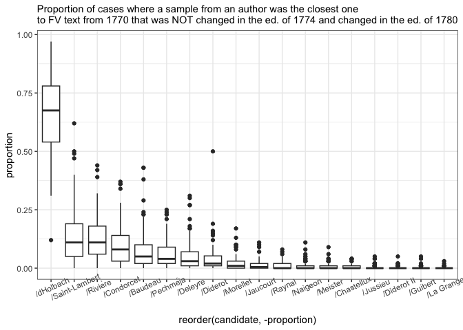

#### 1774-nch1780

``` r
sample_independent_opt(tokenized_df = ed_corpus %>% 
                         filter(!author %in% c("ed1770_CH1774_CH1780", 
                                               "ed1770_CH1774_nch1780", 
                                               "ed1770_nch1774_CH1780", 
                                               "ed1770_nch1774_nch1780", 
                                               "ed1774_CH1780", 
                                               #"ed1774_nch1780", 
                                               "ed1780"
                                               )),
  n_samples = 2,
  sample_size = 5000)

dtm <- diy_stylo(
  folder = "corpus_sampled/",
  mfw = 200,
  drop_words = F)

dim(dtm)

grep("ed", rownames(dtm))

imp_res <- vector(mode = "list")

counter <- 0

for (i in 1:50) {
  
  # create samples for each trial
  sample_independent_opt(
    tokenized_df = ed_corpus %>% 
                         filter(!author %in% c("ed1770_CH1774_CH1780", 
                                               "ed1770_CH1774_nch1780", 
                                               "ed1770_nch1774_CH1780", 
                                               "ed1770_nch1774_nch1780", 
                                               "ed1774_CH1780", 
                                               #"ed1774_nch1780", 
                                               "ed1780"
                                               )), 
    n_samples = 2, 
    sample_size = 5000)
  
  # build doc-term matrix from the samples in the corpus_sampled folder
  data = diy_stylo(mfw = 200, 
                    feature = "word",
                    n_gram = 1)
  
  # test each of the true FV-L1 sets
  for (s in c(13, 14)) {
    
    # run imposters test
    r <- imposters(reference.set = data[-c(13, 14),], # remove test data from the ref
                   test = data[c(s),], # test one of the samples against the others
                   features = 0.5, # test 50% of the features in each trial
                   iterations = 100,
                   distance = "wurzburg"
                   )
    
    # count iterations
    counter <- counter + 1
    
    # store results
    
    imp_res[[counter]] <- tibble(candidate = names(r),
                                 proportion = r)
    
    print(counter)
  }
  
}

saveRDS(imp_res, "imp_res/impr_1774_nch80_2.rds")
```

``` r
imp_res <- readRDS("imp_res/impr_1774_nch80_2.rds")

imp_res %>%
  bind_rows() %>%  #stack all the optained prop tables into one
  mutate(candidate = str_remove(candidate, "^/")) %>% 
  ggplot(aes(x = reorder(candidate, - proportion),
  y = proportion)) +
  geom_boxplot() +
  theme_bw() + 
  labs(subtitle = "Proportion of cases where a sample from an author was the closest one\nto FV text from the ed. of 1774 and not changed in the ed. of 1780 ") +
  theme(axis.text.x = element_text(angle = 25,
                                   size = 12))
```

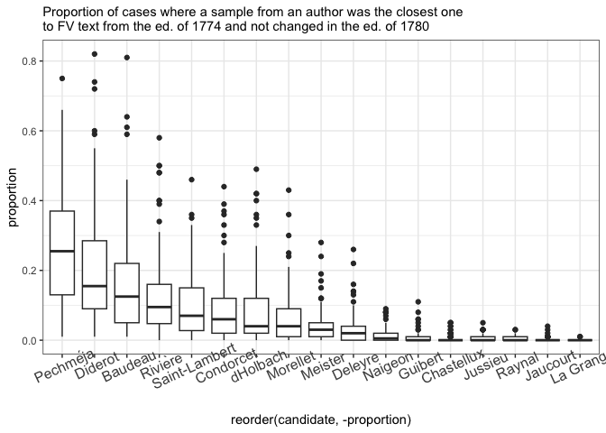

##### important result:

Here it is interesting that both on the simple stylo tree and for
impostors we obtained Pechmeja as the closest candidate. For this text
sample we can look deeper what caused the similarity. NB next closest
neighbor is Diderot.

#### 1774-ch1780

``` r
sample_independent_opt(tokenized_df = ed_corpus %>% 
                         filter(!author %in% c("ed1770_CH1774_CH1780", 
                                               "ed1770_CH1774_nch1780", 
                                               "ed1770_nch1774_CH1780", 
                                               "ed1770_nch1774_nch1780", 
                                               #"ed1774_CH1780", 
                                               "ed1774_nch1780", 
                                               "ed1780"
                                               )),
  n_samples = 2,
  sample_size = 5000)

dtm <- diy_stylo(
  folder = "corpus_sampled/",
  mfw = 200,
  drop_words = F)

dim(dtm)

grep("ed", rownames(dtm))

imp_res <- vector(mode = "list")

counter <- 0

for (i in 1:50) {
  
  # create samples for each trial
  sample_independent_opt(
    tokenized_df = ed_corpus %>% 
                         filter(!author %in% c("ed1770_CH1774_CH1780", 
                                               "ed1770_CH1774_nch1780", 
                                               "ed1770_nch1774_CH1780", 
                                               "ed1770_nch1774_nch1780", 
                                               #"ed1774_CH1780", 
                                               "ed1774_nch1780", 
                                               "ed1780"
                                               )), 
    n_samples = 2, 
    sample_size = 5000)
  
  # build doc-term matrix from the samples in the corpus_sampled folder
  data = diy_stylo(mfw = 200, 
                    feature = "word",
                    n_gram = 1)
  
  # test each of the true FV-L1 sets
  for (s in c(15, 16)) {
    
    # run imposters test
    r <- imposters(reference.set = data[-c(15, 16),], # remove test data from the ref
                   test = data[c(s),], # test one of the samples against the others
                   features = 0.5, # test 50% of the features in each trial
                   iterations = 100,
                   distance = "wurzburg"
                   )
    
    # count iterations
    counter <- counter + 1
    
    # store results
    
    imp_res[[counter]] <- tibble(candidate = names(r),
                                 proportion = r)
    
    print(counter)
  }
  
}

saveRDS(imp_res, "imp_res/impr_1774_ch80.rds")
```

``` r
imp_res <- readRDS("imp_res/impr_1774_ch80.rds")

imp_res %>%
  bind_rows() %>%  #stack all the optained prop tables into one
  ggplot(aes(x = reorder(candidate, - proportion),
  y = proportion)) +
  geom_boxplot() +
  theme_bw() + 
  labs(subtitle = "Proportion of cases where a sample from an author was the closest one\nto FV text from the ed. of 1774 and changed in the ed. of 1780 ") +
  theme(axis.text.x = element_text(angle = 25))
```

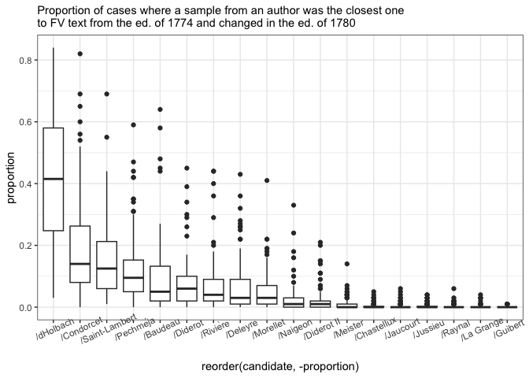

#### 1780

``` r
sample_independent_opt(tokenized_df = ed_corpus %>% 
                         filter(!author %in% c("ed1770_CH1774_CH1780", 
                                               "ed1770_CH1774_nch1780", 
                                               "ed1770_nch1774_CH1780", 
                                               "ed1770_nch1774_nch1780", 
                                               "ed1774_CH1780", 
                                               "ed1774_nch1780"#, 
                                               #"ed1780"
                                               )),
  n_samples = 2,
  sample_size = 5000)

dtm <- diy_stylo(
  folder = "corpus_sampled/",
  mfw = 200,
  drop_words = F)

dim(dtm)

grep("ed", rownames(dtm))

imp_res <- vector(mode = "list")

counter <- 0

for (i in 1:50) {
  
  # create samples for each trial
  sample_independent_opt(
    tokenized_df = ed_corpus %>% 
                         filter(!author %in% c("ed1770_CH1774_CH1780", 
                                               "ed1770_CH1774_nch1780", 
                                               "ed1770_nch1774_CH1780", 
                                               "ed1770_nch1774_nch1780", 
                                               "ed1774_CH1780", 
                                               "ed1774_nch1780"#, 
                                               #"ed1780"
                                               )), 
    n_samples = 2, 
    sample_size = 5000)
  
  # build doc-term matrix from the samples in the corpus_sampled folder
  data = diy_stylo(mfw = 200, 
                    feature = "word",
                    n_gram = 1)
  
  # test each of the true FV-L1 sets
  for (s in c(15, 16)) {
    
    # run imposters test
    r <- imposters(reference.set = data[-c(15, 16),], # remove test data from the ref
                   test = data[c(s),], # test one of the samples against the others
                   features = 0.5, # test 50% of the features in each trial
                   iterations = 100,
                   distance = "wurzburg"
                   )
    
    # count iterations
    counter <- counter + 1
    
    # store results
    
    imp_res[[counter]] <- tibble(candidate = names(r),
                                 proportion = r)
    
    print(counter)
  }
  
}

saveRDS(imp_res, "imp_res/impr_1780.rds")
```

``` r
imp_res <- readRDS("imp_res/impr_1780.rds")

imp_res %>%
  bind_rows() %>%  #stack all the optained prop tables into one
  ggplot(aes(x = reorder(candidate, - proportion),
  y = proportion)) +
  geom_boxplot() +
  theme_bw() + 
  labs(subtitle = "Proportion of cases where a sample from an author was the closest one\nto FV text from the ed. of 1774 and changed in the ed. of 1780 ") +
  theme(axis.text.x = element_text(angle = 25))
```

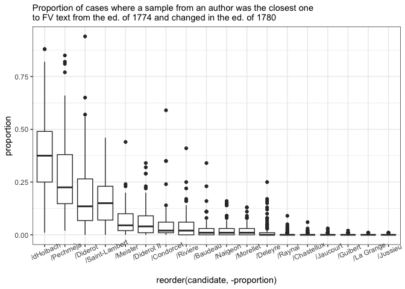

### Current conclusions

-   D’Holbach signal is very strong, especially in the earlier editions:
    e.g., he can be the candidate for the authorship for the fragments
    appeared in 1770 and remained unchanged (1770-nch1774-nch1780),
    probably for 1770 & changed later as well (both 1770-ch1774-nch1780
    & 1770-ch1774-ch1780);

-   The most interesting finding: the fragments which not appeared in
    1770, but in 1774 and were not changed in 1780. There is no
    certainty about the authorship, but Pechmeja, Diderot, and Baudeau
    are the first three candidates. If that is interesting and make
    sense, this might be further investigated;

-   The situation for fragments appeared in 1774 but changed later is
    different, there is still no certain candidate, but the similarity
    with d’Holbach’s writings appeared again;

-   For the fragments appeared in 1780: also might be interesting, as
    now no author is likely the author, not even d’Holbach; however,
    there are some signs of Pechmeja and Diderot style.

## PART II. Pensées détachées vs Mélanges

Or “pencil vs ink”.

The data is gathered using respective two columns from the metadata. All
fragments marked as included to Pensées détachées or Mélanges are
brought together in one file. These files are used for sampling and
tests. An important difference from all other tests in this case is that
both test samples here are quite large, i.e., the results might be more
robust.

``` r
# select test texts from the corpus
pencil_ink_corpus <- rbind(ink_pencil, corpus_tokenized)

# unique(pencil_ink_corpus$author)
# 
# pencil_ink_corpus %>% 
#   filter(author %in% c("ink_melanges", "pencil_pensees_detachees")) %>% 
#   count(author)
```

### Stylo basic exploration

take samples

``` r
sample_independent_opt(tokenized_df = pencil_ink_corpus %>% 
                         filter(!author %in% c(#"ink_melanges",
                                               "pencil_pensees_detachees")),
  n_samples = 2,
  sample_size = 5000)

test1 <- stylo(
  gui = F,
  corpus.dir = "corpus_sampled/",
  corpus.lang = "French",
  mfw.min = 200,
  mfw.max = 200,
  analyzed.features = "w",
  ngram.size = 1,
  distance.measure = "wurzburg"
  )
```

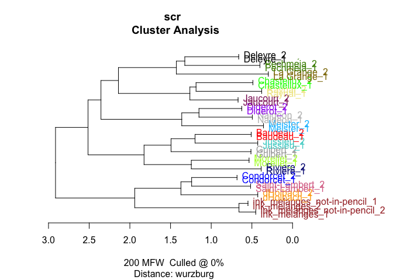

``` r
sample_independent_opt(tokenized_df = pencil_ink_corpus %>% 
                         filter(!author %in% c("ink_melanges"
                                               #, "pencil_pensees_detachees"
                                               )),
  n_samples = 2,
  sample_size = 5000)

test1 <- stylo(
  gui = F,
  corpus.dir = "corpus_sampled/",
  corpus.lang = "French",
  mfw.min = 200,
  mfw.max = 200,
  analyzed.features = "w",
  ngram.size = 1,
  distance.measure = "wurzburg"
  )
```

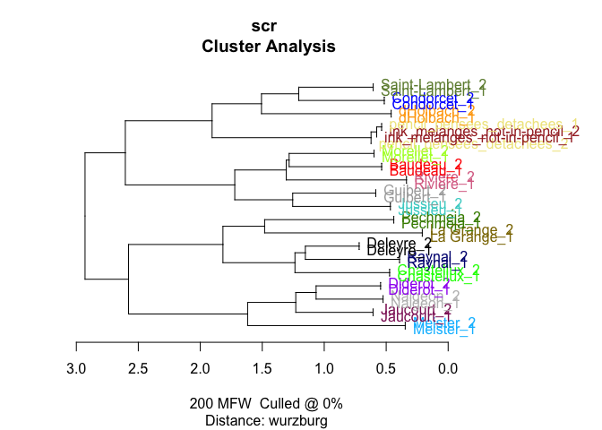

### Imposters

#### Pensées détachées (pencil)

``` r
sample_independent_opt(tokenized_df = pencil_ink_corpus %>% 
                         filter(!author %in% c("ink_melanges"
                                               #, "pencil_pensees_detachees"
                                               )),
                       n_samples = 2,
                       sample_size = 5000)

dtm <- diy_stylo(
  folder = "corpus_sampled/",
  mfw = 200,
  drop_words = F)

dim(dtm)

grep("pencil", rownames(dtm))

imp_res <- vector(mode = "list")

counter <- 0

for (i in 1:50) {
  
  # create samples for each trial
  sample_independent_opt(
    tokenized_df = pencil_ink_corpus %>% 
                         filter(!author %in% c("ink_melanges"
                                               #, "pencil_pensees_detachees"
                                               )), 
    n_samples = 2, 
    sample_size = 5000)
  
  # build doc-term matrix from the samples in the corpus_sampled folder
  data = diy_stylo(mfw = 200, 
                    feature = "word",
                    n_gram = 1)
  
  # test each of the true FV-L1 sets
  for (s in c(31, 32)) {
    
    # run imposters test
    r <- imposters(reference.set = data[-c(31, 32),], # remove test data from the ref
                   test = data[c(s),], # test one of the samples against the others
                   features = 0.5, # test 50% of the features in each trial
                   iterations = 100,
                   distance = "wurzburg"
                   )
    
    # count iterations
    counter <- counter + 1
    
    # store results
    
    imp_res[[counter]] <- tibble(candidate = names(r),
                                 proportion = r)
    
    print(counter)
  }
  
}

saveRDS(imp_res, "imp_res/impr_pencil.rds")
```

``` r
imp_res <- readRDS("imp_res/impr_pencil.rds")

imp_res %>%
  bind_rows() %>%  #stack all the optained prop tables into one
  ggplot(aes(x = reorder(candidate, - proportion),
  y = proportion)) +
  geom_boxplot() +
  theme_bw() + 
  labs(subtitle = "Proportion of cases where a sample from an author was the closest one\nto FV texts from Pensées détachées") +
  theme(axis.text.x = element_text(angle = 25))
```

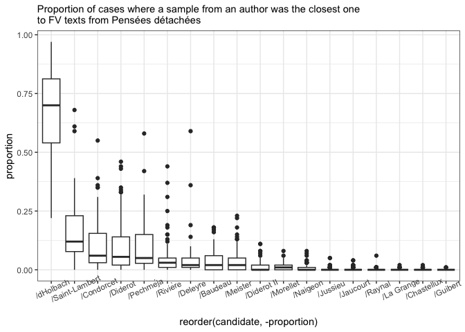

#### Mélanges (ink)

``` r
sample_independent_opt(tokenized_df = pencil_ink_corpus %>% 
                         filter(!author %in% c(#"ink_melanges",
                           "ink_melanges_not-in-pencil",
                                               "pencil_pensees_detachees"
                                               )),
                       n_samples = 2,
                       sample_size = 5000)

dtm <- diy_stylo(
  folder = "corpus_sampled/",
  mfw = 200,
  drop_words = F)

dim(dtm)

grep("ink", rownames(dtm))

imp_res <- vector(mode = "list")

counter <- 0

for (i in 1:50) {
  
  # create samples for each trial
  sample_independent_opt(
    tokenized_df = pencil_ink_corpus %>% 
                         filter(!author %in% c(# "ink_melanges"
                                               "pencil_pensees_detachees"
                                               )), 
    n_samples = 2, 
    sample_size = 5000)
  
  # build doc-term matrix from the samples in the corpus_sampled folder
  data = diy_stylo(mfw = 200, 
                    feature = "word",
                    n_gram = 1)
  
  # test each of the true FV-L1 sets
  for (s in c(15, 16)) {
    
    # run imposters test
    r <- imposters(reference.set = data[-c(15, 16),], # remove test data from the ref
                   test = data[c(s),], # test one of the samples against the others
                   features = 0.5, # test 50% of the features in each trial
                   iterations = 100,
                   distance = "wurzburg"
                   )
    
    # count iterations
    counter <- counter + 1
    
    # store results
    
    imp_res[[counter]] <- tibble(candidate = names(r),
                                 proportion = r)
    
    print(counter)
  }
  
}

saveRDS(imp_res, "imp_res/impr_ink_2.rds")
```

``` r
imp_res <- readRDS("imp_res/impr_ink_2.rds")

imp_res %>%
  bind_rows() %>%  #stack all the optained prop tables into one
  ggplot(aes(x = reorder(candidate, - proportion),
  y = proportion)) +
  geom_boxplot() +
  theme_bw() + 
  labs(subtitle = "Proportion of cases where a sample from an author was the closest one\nto FV texts from Mélanges (ink)") +
  theme(axis.text.x = element_text(angle = 25))
```

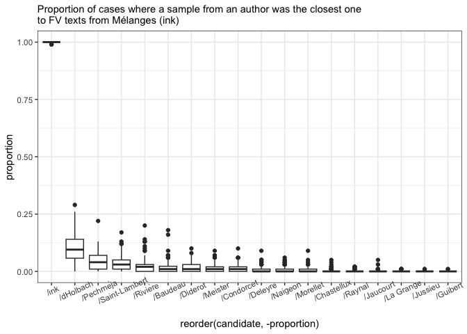

### Current conclusions

-   At the first glance, the situation is very similar with the results
    from Part I, namely the d’Holbach closeness to the target texts;

-   However, the two samples are quite different in terms of the
    imposters’ outcome, as the Pensées détachées (pencil) are definitely
    close to d’Holbach, but Mélanges (ink) shows no trustworthy
    similarity.

## PART III. ‘Likely Diderot’ book-level check

Data: the book fragments (from FV) recombined as thematically likely to
be Diderot’s

Set: Livre 4 & Livre 12, Livre 4 & 12, Livre 5 & 12, Livre 5 & 13

The test fragments are temporary named as ‘diderot’ at the moment to
simplify coding.

``` r
# select test texts from the corpus
diderot_corpus <- rbind(diderot, corpus_tokenized)

unique(diderot_corpus$author)
```

     [1] "diderot_fv_l4_l12" "diderot_fv_l4_l13" "diderot_fv_l5_l12"
     [4] "diderot_fv_l5_l13" "Baudeau"           "Chastellux"       
     [7] "Condorcet"         "dHolbach"          "Deleyre"          
    [10] "Diderot"           "Guibert"           "Jaucourt"         
    [13] "Jussieu"           "Meister"           "Morellet"         
    [16] "Naigeon"           "Pechméja"          "Raynal"           
    [19] "Rivière"           "Saint-Lambert"     "La Grange"        

``` r
diderot_corpus %>% 
  filter(author %in% c("diderot_fv_l4_l12", 
                       "diderot_fv_l4_l13", 
                       "diderot_fv_l5_l12", 
                       "diderot_fv_l5_l13")) %>% 
  count(author)
```

    # A tibble: 4 × 2
      author                n
      <chr>             <int>
    1 diderot_fv_l4_l12  8295
    2 diderot_fv_l4_l13  8659
    3 diderot_fv_l5_l12 12928
    4 diderot_fv_l5_l13 13292

### stylo

``` r
sample_independent_opt(tokenized_df = diderot_corpus %>% 
                         filter(!author %in% c(#"diderot_fv_l4_l12", 
                                               "diderot_fv_l4_l13", 
                                               "diderot_fv_l5_l12", 
                                               "diderot_fv_l5_l13")),
                       n_samples = 2,
                       sample_size = 4000)

test1 <- stylo(
  gui = F,
  corpus.dir = "corpus_sampled/",
  corpus.lang = "French",
  mfw.min = 200,
  mfw.max = 200,
  analyzed.features = "w",
  ngram.size = 1,
  distance.measure = "wurzburg"
  )
```

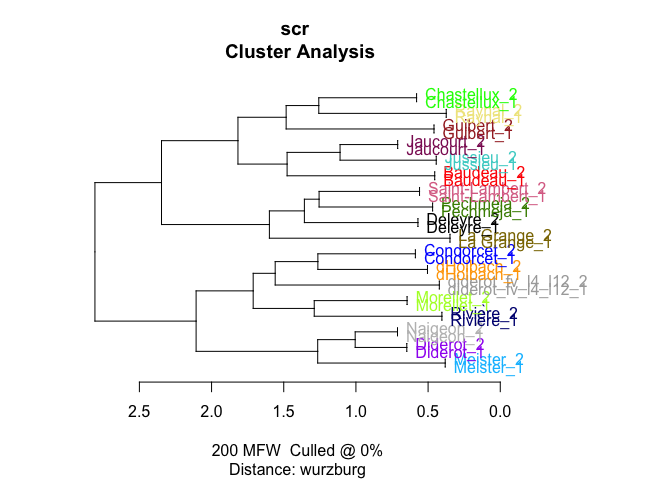

``` r
sample_independent_opt(tokenized_df = diderot_corpus %>% 
                         filter(!author %in% c("diderot_fv_l4_l12", 
                                               #"diderot_fv_l4_l13", 
                                               "diderot_fv_l5_l12", 
                                               "diderot_fv_l5_l13")),
                       n_samples = 2,
                       sample_size = 4000)

test1 <- stylo(
  gui = F,
  corpus.dir = "corpus_sampled/",
  corpus.lang = "French",
  mfw.min = 200,
  mfw.max = 200,
  analyzed.features = "w",
  ngram.size = 1,
  distance.measure = "wurzburg"
  )
```

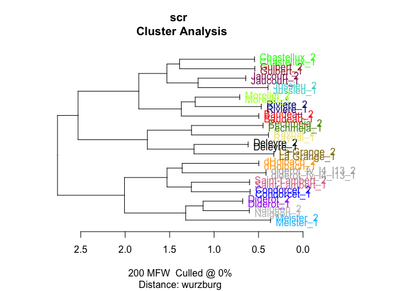

``` r
sample_independent_opt(tokenized_df = diderot_corpus %>% 
                         filter(!author %in% c("diderot_fv_l4_l12", 
                                               "diderot_fv_l4_l13", 
                                               #"diderot_fv_l5_l12", 
                                               "diderot_fv_l5_l13")),
                       n_samples = 2,
                       sample_size = 5000)

test1 <- stylo(
  gui = F,
  corpus.dir = "corpus_sampled/",
  corpus.lang = "French",
  mfw.min = 200,
  mfw.max = 200,
  analyzed.features = "w",
  ngram.size = 1,
  distance.measure = "wurzburg"
  )
```

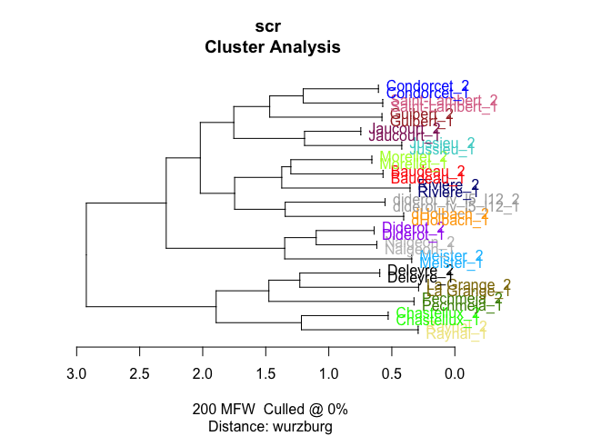

``` r
sample_independent_opt(tokenized_df = diderot_corpus %>% 
                         filter(!author %in% c("diderot_fv_l4_l12", 
                                               "diderot_fv_l4_l13", 
                                               "diderot_fv_l5_l12"
                                               #, 
                                               #"diderot_fv_l5_l13"
                                               )),
                       n_samples = 2,
                       sample_size = 5000)

test1 <- stylo(
  gui = F,
  corpus.dir = "corpus_sampled/",
  corpus.lang = "French",
  mfw.min = 200,
  mfw.max = 200,
  analyzed.features = "w",
  ngram.size = 1,
  distance.measure = "wurzburg"
  )
```

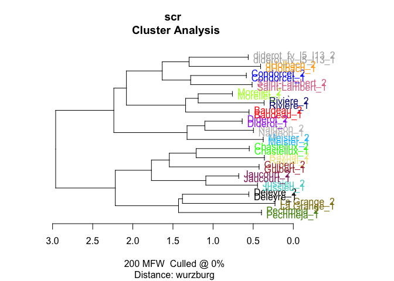

### Imposters

#### l4 l12

``` r
sample_independent_opt(tokenized_df = diderot_corpus %>% 
                         filter(!author %in% c(#"diderot_fv_l4_l12", 
                                               "diderot_fv_l4_l13", 
                                               "diderot_fv_l5_l12", 
                                               "diderot_fv_l5_l13"
                                               )),
                       n_samples = 2,
                       sample_size = 4000)

dtm <- diy_stylo(
  folder = "corpus_sampled/",
  mfw = 200,
  drop_words = F)

dim(dtm)

grep("diderot_fv", rownames(dtm))

imp_res <- vector(mode = "list")

counter <- 0

for (i in 1:50) {
  
  # create samples for each trial
  sample_independent_opt(
    tokenized_df = diderot_corpus %>% 
                         filter(!author %in% c(#"diderot_fv_l4_l12", 
                                               "diderot_fv_l4_l13", 
                                               "diderot_fv_l5_l12", 
                                               "diderot_fv_l5_l13"
                                               )), 
    n_samples = 2, 
    sample_size = 4000)
  
  # build doc-term matrix from the samples in the corpus_sampled folder
  data = diy_stylo(mfw = 200, 
                    feature = "word",
                    n_gram = 1)
  
  # test each of the true FV-L1 sets
  for (s in c(15, 16)) {
    
    # run imposters test
    r <- imposters(reference.set = data[-c(15, 16),], # remove test data from the ref
                   test = data[c(s),], # test one of the samples against the others
                   features = 0.5, # test 50% of the features in each trial
                   iterations = 100,
                   distance = "wurzburg"
                   )
    
    # count iterations
    counter <- counter + 1
    
    # store results
    
    imp_res[[counter]] <- tibble(candidate = names(r),
                                 proportion = r)
    
    print(counter)
  }
  
}

saveRDS(imp_res, "imp_res/impr_diderot_l4_l12.rds")
```

``` r
imp_res <- readRDS("imp_res/impr_diderot_l4_l12.rds")

imp_res %>%
  bind_rows() %>%  #stack all the optained prop tables into one
  ggplot(aes(x = reorder(candidate, - proportion),
  y = proportion)) +
  geom_boxplot() +
  theme_bw() + 
  labs(subtitle = "Proportion of cases where a sample from an author was the closest one\nto texts from FV livres 4 & 12") +
  theme(axis.text.x = element_text(angle = 25))
```

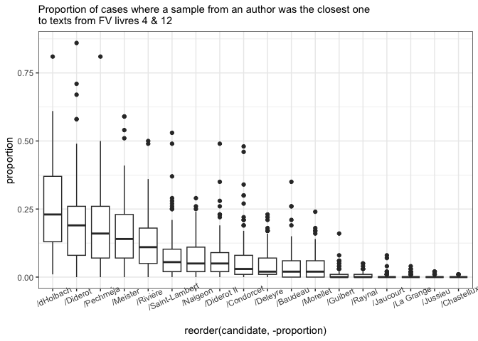

#### l4 l13

``` r
sample_independent_opt(tokenized_df = diderot_corpus %>% 
                         filter(!author %in% c("diderot_fv_l4_l12", 
                                               #"diderot_fv_l4_l13", 
                                               "diderot_fv_l5_l12", 
                                               "diderot_fv_l5_l13"
                                               )),
                       n_samples = 2,
                       sample_size = 4000)

dtm <- diy_stylo(
  folder = "corpus_sampled/",
  mfw = 200,
  drop_words = F)

dim(dtm)

grep("diderot_fv", rownames(dtm))

imp_res <- vector(mode = "list")

counter <- 0

for (i in 1:50) {
  
  # create samples for each trial
  sample_independent_opt(
    tokenized_df = diderot_corpus %>% 
                         filter(!author %in% c("diderot_fv_l4_l12", 
                                               #"diderot_fv_l4_l13", 
                                               "diderot_fv_l5_l12", 
                                               "diderot_fv_l5_l13"
                                               )), 
    n_samples = 2, 
    sample_size = 4000)
  
  # build doc-term matrix from the samples in the corpus_sampled folder
  data = diy_stylo(mfw = 200, 
                    feature = "word",
                    n_gram = 1)
  
  # test each of the true FV-L1 sets
  for (s in c(15, 16)) {
    
    # run imposters test
    r <- imposters(reference.set = data[-c(15, 16),], # remove test data from the ref
                   test = data[c(s),], # test one of the samples against the others
                   features = 0.5, # test 50% of the features in each trial
                   iterations = 100,
                   distance = "wurzburg"
                   )
    
    # count iterations
    counter <- counter + 1
    
    # store results
    
    imp_res[[counter]] <- tibble(candidate = names(r),
                                 proportion = r)
    
    print(counter)
  }
  
}

saveRDS(imp_res, "imp_res/impr_diderot_l4_l13.rds")
```

``` r
imp_res <- readRDS("imp_res/impr_diderot_l4_l13.rds")

imp_res %>%
  bind_rows() %>%  #stack all the optained prop tables into one
  ggplot(aes(x = reorder(candidate, - proportion),
  y = proportion)) +
  geom_boxplot() +
  theme_bw() + 
  labs(subtitle = "Proportion of cases where a sample from an author was the closest one\nto texts from FV livres 4 & 13") +
  theme(axis.text.x = element_text(angle = 25))
```

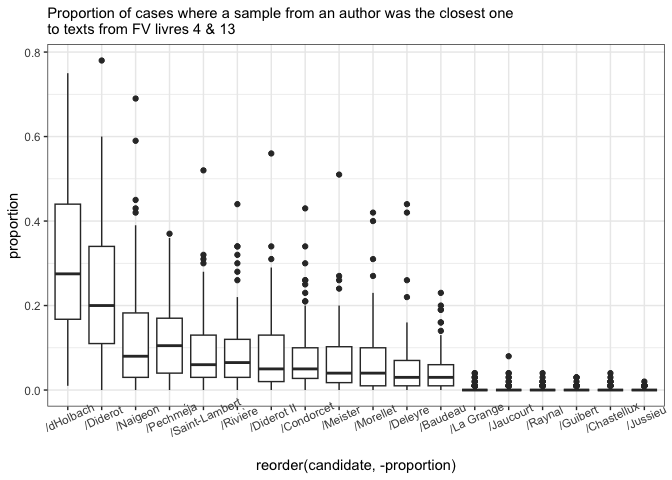

#### l5 l12

``` r
sample_independent_opt(tokenized_df = diderot_corpus %>% 
                         filter(!author %in% c("diderot_fv_l4_l12", 
                                               "diderot_fv_l4_l13", 
                                               #"diderot_fv_l5_l12", 
                                               "diderot_fv_l5_l13"
                                               )),
                       n_samples = 2,
                       sample_size = 5000)

dtm <- diy_stylo(
  folder = "corpus_sampled/",
  mfw = 200,
  drop_words = F)

dim(dtm)

grep("diderot_fv", rownames(dtm))

imp_res <- vector(mode = "list")

counter <- 0

for (i in 1:50) {
  
  # create samples for each trial
  sample_independent_opt(
    tokenized_df = diderot_corpus %>% 
                         filter(!author %in% c("diderot_fv_l4_l12", 
                                               "diderot_fv_l4_l13", 
                                               #"diderot_fv_l5_l12", 
                                               "diderot_fv_l5_l13"
                                               )), 
    n_samples = 2, 
    sample_size = 5000)
  
  # build doc-term matrix from the samples in the corpus_sampled folder
  data = diy_stylo(mfw = 200, 
                    feature = "word",
                    n_gram = 1)
  
  # test each of the true FV-L1 sets
  for (s in c(15, 16)) {
    
    # run imposters test
    r <- imposters(reference.set = data[-c(15, 16),], # remove test data from the ref
                   test = data[c(s),], # test one of the samples against the others
                   features = 0.5, # test 50% of the features in each trial
                   iterations = 100,
                   distance = "wurzburg"
                   )
    
    # count iterations
    counter <- counter + 1
    
    # store results
    
    imp_res[[counter]] <- tibble(candidate = names(r),
                                 proportion = r)
    
    print(counter)
  }
  
}

saveRDS(imp_res, "imp_res/impr_diderot_l5_l12.rds")
```

``` r
imp_res <- readRDS("imp_res/impr_diderot_l5_l12.rds")

imp_res %>%
  bind_rows() %>%  #stack all the optained prop tables into one
  ggplot(aes(x = reorder(candidate, - proportion),
  y = proportion)) +
  geom_boxplot() +
  theme_bw() + 
  labs(subtitle = "Proportion of cases where a sample from an author was the closest one\nto texts from FV livres 5 & 12") +
  theme(axis.text.x = element_text(angle = 25))
```

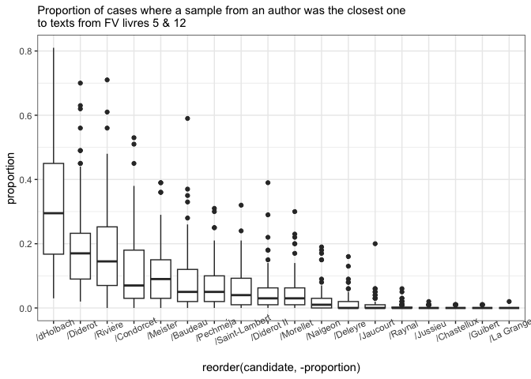

#### l5 l13

``` r
sample_independent_opt(tokenized_df = diderot_corpus %>% 
                         filter(!author %in% c("diderot_fv_l4_l12", 
                                               "diderot_fv_l4_l13", 
                                               "diderot_fv_l5_l12" #, 
                                               #"diderot_fv_l5_l13"
                                               )),
                       n_samples = 2,
                       sample_size = 5000)

dtm <- diy_stylo(
  folder = "corpus_sampled/",
  mfw = 200,
  drop_words = F)

dim(dtm)

grep("diderot_fv", rownames(dtm))

imp_res <- vector(mode = "list")

counter <- 0

for (i in 1:50) {
  
  # create samples for each trial
  sample_independent_opt(
    tokenized_df = diderot_corpus %>% 
                         filter(!author %in% c("diderot_fv_l4_l12", 
                                               "diderot_fv_l4_l13", 
                                               "diderot_fv_l5_l12" #, 
                                               #"diderot_fv_l5_l13"
                                               )), 
    n_samples = 2, 
    sample_size = 5000)
  
  # build doc-term matrix from the samples in the corpus_sampled folder
  data = diy_stylo(mfw = 200, 
                    feature = "word",
                    n_gram = 1)
  
  # test each of the true FV-L1 sets
  for (s in c(15, 16)) {
    
    # run imposters test
    r <- imposters(reference.set = data[-c(15, 16),], # remove test data from the ref
                   test = data[c(s),], # test one of the samples against the others
                   features = 0.5, # test 50% of the features in each trial
                   iterations = 100,
                   distance = "wurzburg"
                   )
    
    # count iterations
    counter <- counter + 1
    
    # store results
    
    imp_res[[counter]] <- tibble(candidate = names(r),
                                 proportion = r)
    
    print(counter)
  }
  
}

saveRDS(imp_res, "imp_res/impr_diderot_l5_l13.rds")
```

``` r
imp_res <- readRDS("imp_res/impr_diderot_l5_l13.rds")

imp_res %>%
  bind_rows() %>%  #stack all the optained prop tables into one
  ggplot(aes(x = reorder(candidate, - proportion),
  y = proportion)) +
  geom_boxplot() +
  theme_bw() + 
  labs(subtitle = "Proportion of cases where a sample from an author was the closest one\nto texts from FV livres 5 & 13") +
  theme(axis.text.x = element_text(angle = 25))
```

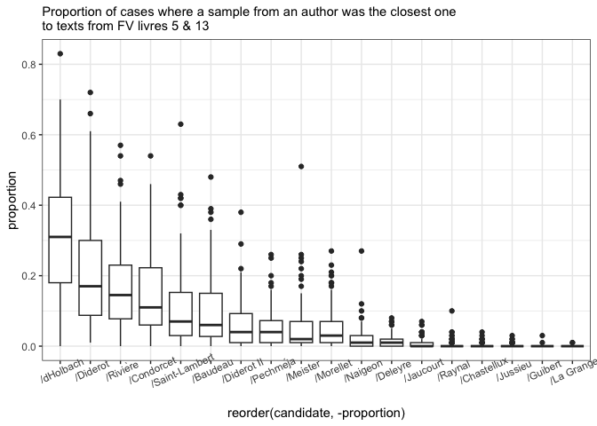

### Current conclusions

-   In all tests for all books combinations the classifier was very
    unsure about the authorship. The signal for d’Holbach remains, but
    it is not as strong;

-   What is different from other tests, in this case Diderot is always
    somewhere close as a second candidate (though the algorithm is not
    providing any conclusive results at all).
